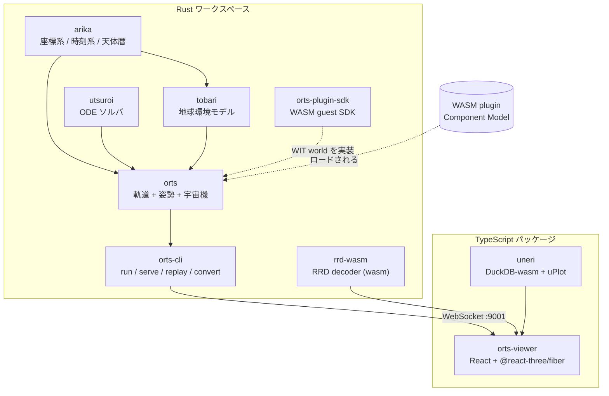
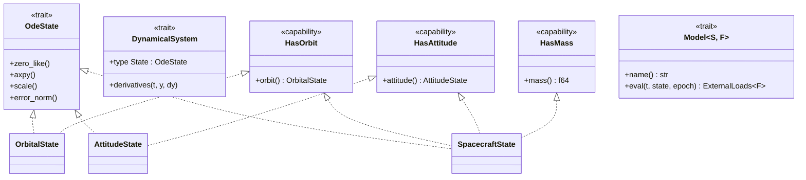
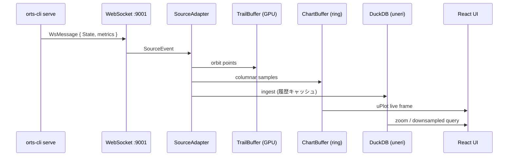

# アーキテクチャ

> English: [ARCHITECTURE.md](ARCHITECTURE.md)

## 1. 全体像

orts は Rust ワークスペース (シミュレーションコア + CLI + プラグイン SDK) と
TypeScript 側 (リアルタイム 3D ビューア + ストリーミングチャート) に分かれる。
両者は live では WebSocket で、replay ではファイル (RRD / CSV) で繋がる。

## 2. Rust ワークスペースの層構造

| Layer | Crate | 責務 |
|-------|-------|------|
| Foundation | [`utsuroi`](utsuroi/) | 汎用 ODE ソルバ (RK4, DOP853, Dormand-Prince, Störmer-Verlet, Yoshida)。`OdeState`, `DynamicalSystem` trait を提供。 |
| Foundation | [`arika`](arika/) | 型安全な座標系 (ECI / ECEF / IAU)、時刻系 (UTC / TT / TDB / TAI)、Meeus 解析天体暦、JPL Horizons 取得、WGS-84、EOP。 |
| Environment | [`tobari`](tobari/) | 大気モデル (Exponential, Harris-Priester, NRLMSISE-00)、地磁気場 (IGRF-14, 傾斜双極子)、宇宙天気プロバイダ (CSSI, GFZ)。 |
| Simulation | [`orts`](orts/) | `OrbitalState` / `AttitudeState` / `SpacecraftState`、統一 `Model<S, F>` trait、`OrbitalSystem` / `AttitudeSystem` / `SpacecraftDynamics`、センサモデル、プラグインホスト、Rerun `.rrd` 出力。 |
| Application | [`orts-cli`](cli/) | `orts run` / `orts serve` / `orts replay` / `orts convert`。viewer を埋め込み、port 9001 で WebSocket ストリームを公開。 |
| Extension | [`orts-plugin-sdk`](plugin-sdk/) | WASM plugin guest 制御則を書くための Rust SDK (callback 形式 / main-loop 形式)。 |
| Bridge | [`rrd-wasm`](rrd-wasm/) | Rerun RRD デコーダを WebAssembly にコンパイルしたもの。ブラウザ内 replay 用。 |

## 3. 中核の trait 階層

シミュレーションコアは 2 つの軸で組み立てられている。`utsuroi` の汎用数値積分
抽象と、`orts` の capability-based モデル機構 — これにより、同一の摂動モデルを
orbit-only / attitude-only / 結合 spacecraft のどのシステムからでも再利用できる。

要点:

- `Model<S, F>` は必要とする state の capability を `S` の trait bound として
  宣言する (例: 大気抵抗は `impl<S: HasOrbit> Model<S>`、重力傾斜トルクは
  `impl<S: HasAttitude + HasOrbit> Model<S>`)。同じ実装を、bound を満たす
  あらゆる System にそのまま差し込める。
- `F: Eci` パラメータは返り値 `ExternalLoads<F>` の慣性系を選択し、
  デフォルトは `SimpleEci`。既存コードの `Model<OrbitalState>` はそのまま動く。
- System は 3 種類 — `OrbitalSystem` / `AttitudeSystem` /
  `SpacecraftDynamics` — いずれも state と `Vec<Box<dyn Model<S, F>>>` を
  束ねる `DynamicalSystem`。

## 4. プラグインシステム

姿勢制御則やモード管理といった guest 制御則は WebAssembly サンドボックスで
動く。これにより WASI + Component Model をターゲットにできる任意の言語で
制御則を書ける。

- **インターフェース:** WIT world
  [`orts/wit/v0/orts.wit`](orts/wit/v0/orts.wit)
- **World exports** (guest → host): `metadata(config)`, `run(config)`,
  `current-mode()`
- **World imports** (host → guest): `host-env` (地磁気場取得、log)、
  `tick-io` (`wait_tick`, `send_command`)
- **Tick ごとの契約:** host が `TickInput` (真値 state + デバイスごとの
  sensor 読み値 + actuator テレメトリ) を渡し、guest が `Command` (MTQ 毎の
  磁気モーメント、RW 毎の回転速度 or トルク、スラスタ毎のスロットル) を返す。
- **ランタイム:** `wasmtime` の Pulley interpreter + `Config::consume_fuel()`
  でホスト非依存な決定論的実行を保証。
- **配布:** `.wasm` (可搬) と `.cwasm` (wasmtime 固有の事前コンパイル済)。

Native Rust 制御則も同じ `DiscreteController` trait を実装するので、WASM
guest と native 実装の差し替えは設定ファイルの変更だけで済む。

## 5. データフロー (シミュレーション → viewer)

- **Live path (hot):** `ChartBuffer` から uPlot に直結。DuckDB は live
  レンダ経路に乗っていない。
- **History path (cold):** `IngestBuffer` → DuckDB が zoom / downsample /
  事後クエリ用のキャッシュ。ring buffer と eventually consistent。
- **Source 抽象:** `WebSocketAdapter` / `CSVFileAdapter` /
  `RrdFileAdapter` はすべて同じ `SourceEvent` ストリームに正規化されるため、
  live と replay は単一パイプラインを通る。

## 6. 設計原則

1. **Capability-based composition.** State は提供するもの (`HasOrbit`,
   `HasAttitude`, `HasMass`) を宣言し、Model は必要とするものを宣言する。
   これが、同一の drag 実装を `OrbitalSystem` と `SpacecraftDynamics` で
   重複なく再利用できる仕組み。
2. **型安全な座標系。** `Vec3<F: Frame>` により ECI / ECEF / Body を別型に
   することで、frame の取り違えを silent bug ではなくコンパイルエラーにする。
3. **ホットパスはモノモーフィゼーション重視。** ODE state は固定次元
   (6D / 7D / 13D+) なので integrator はタイトにインライン化される。可変 N
   (コンステレーション、柔軟構造) は `GroupState<S: OdeState>` で扱う。
4. **決定論的 plugin 実行。** Pulley interpreter + fuel budget により、
   ホストや CI 環境に依らず guest の挙動が再現可能。
5. **Viewer 端での Source 抽象化。** Transport (WS / CSV / RRD) は単一の
   `SourceEvent` 型に正規化されるため、新しい source を追加するには adapter
   を 1 つ書くだけで済む。

## 7. 関連ドキュメント

- [DESIGN.md](DESIGN.md) — 詳細な設計意図 (Japanese)
- [README.md](README.md) — インストール、クイックスタート、機能一覧
- [CLAUDE.md](CLAUDE.md) — このリポジトリで作業する Claude Code 向けガイド
- Docs サイト: <https://sksat.github.io/orts/>
- 各 crate の `README.md`: [`orts/`](orts/), [`arika/`](arika/),
  [`utsuroi/`](utsuroi/), [`tobari/`](tobari/), [`uneri/`](uneri/),
  [`viewer/`](viewer/), [`plugin-sdk/`](plugin-sdk/)
