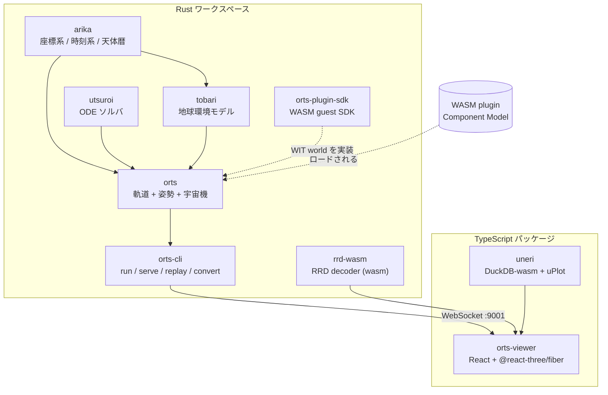
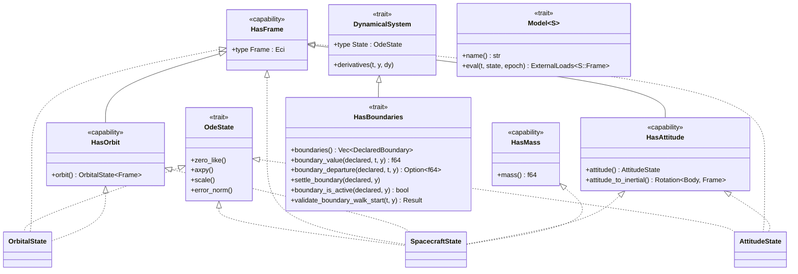
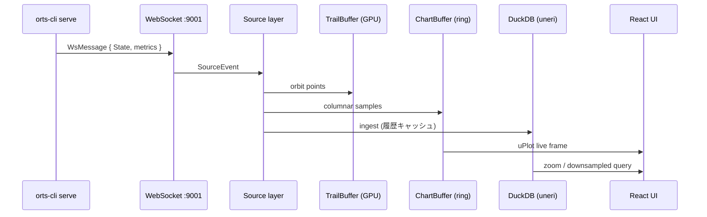

# アーキテクチャ

> English: [ARCHITECTURE.md](ARCHITECTURE.md)

## 1. 全体像

orts は Rust ワークスペース (シミュレーションコア + CLI + プラグイン SDK) と
TypeScript 側 (リアルタイム 3D ビューア + ストリーミングチャート) に分かれる。
両者は live では WebSocket で、replay ではファイル (RRD / CSV) で繋がる。

```mermaid
flowchart TB
  subgraph rust["Rust ワークスペース"]
    utsuroi["utsuroi<br/>ODE ソルバ"]
    arika["arika<br/>座標系 / 時刻系 / 天体暦"]
    tobari["tobari<br/>地球環境モデル"]
    orts["orts<br/>軌道 + 姿勢 + 宇宙機"]
    cli["orts-cli<br/>run / serve / replay / convert"]
    sdk["orts-plugin-sdk<br/>WASM guest SDK"]
    rrdwasm["rrd-wasm<br/>RRD decoder (wasm)"]
  end
  subgraph ts["TypeScript パッケージ"]
    uneri["uneri<br/>DuckDB-wasm + uPlot"]
    viewer["orts-viewer<br/>React + @react-three/fiber"]
  end
  wasm[(WASM plugin<br/>Component Model)]

  arika --> tobari
  arika --> orts
  utsuroi --> orts
  tobari --> orts
  orts --> cli
  sdk -. WIT world を実装 .-> orts
  wasm -. ロードされる .-> orts
  cli -- WebSocket :9001 --> viewer
  rrdwasm --> viewer
  uneri --> viewer
```

## 2. Rust ワークスペースの層構造

| Layer | Crate | 責務 |
|-------|-------|------|
| Foundation | [`utsuroi`](utsuroi/) | 汎用 ODE ソルバ (RK4, DOP853, Dormand-Prince, Störmer-Verlet, Yoshida)。`OdeState`, `DynamicalSystem` trait と、時刻について符号変化を探す root event の探索 (`RootEvent` / `RootSearch`) を提供。 |
| Foundation | [`arika`](arika/) | 型安全な座標系 (ECI / ECEF / IAU)、時刻系 (UTC / TT / TDB / TAI)、Meeus 解析天体暦、JPL Horizons 取得、WGS-84、EOP。 |
| Environment | [`tobari`](tobari/) | 大気モデル (Exponential, Harris-Priester, NRLMSISE-00)、球面調和重力場 (`SphericalHarmonicCoefficients`: ICGEM `.gfc` loader、`SphericalHarmonicField`: degree × order 窓の Holmes–Featherstone 評価)、地磁気場 (IGRF-14, 傾斜双極子)、宇宙天気プロバイダ (CSSI, GFZ)。 |
| Simulation | [`orts`](orts/) | `OrbitalState` / `AttitudeState` / `SpacecraftState`、統一 `Model<S>` trait、`OrbitalSystem` / `AttitudeSystem` / `SpacecraftDynamics`、センサモデル、プラグインホスト、Rerun `.rrd` 出力。 |
| Application | [`orts-cli`](cli/) | `orts run` / `orts serve` / `orts replay` / `orts convert`。viewer を埋め込み、port 9001 で WebSocket ストリームを公開。伝播 frame の解決 (`--frame simple-eci` / `gcrs`) もここで行う (`sim::frame::RunFrame`)。 |
| Extension | [`orts-plugin-sdk`](plugin-sdk/) | WASM plugin guest 制御則を書くための Rust SDK (callback 形式 / main-loop 形式)。 |
| Bridge | [`rrd-wasm`](rrd-wasm/) | Rerun RRD デコーダを WebAssembly にコンパイルしたもの。ブラウザ内 replay 用。 |

## 3. 中核の trait 階層

シミュレーションコアは 2 つの軸で組み立てられている。`utsuroi` の汎用数値積分
抽象と、`orts` の capability-based モデル機構 — これにより、同一の摂動モデルを
orbit-only / attitude-only / 結合 spacecraft のどのシステムからでも再利用できる。

```mermaid
classDiagram
  class OdeState {
    <<trait>>
    +zero_like()
    +axpy()
    +scale()
    +error_norm()
  }
  class DynamicalSystem {
    <<trait>>
    +type State : OdeState
    +derivatives(t, y, dy)
  }

  class HasFrame {
    <<capability>>
    +type Frame : Eci
  }
  class HasOrbit {
    <<capability>>
    +orbit() OrbitalState~Frame~
  }
  class HasAttitude {
    <<capability>>
    +attitude() AttitudeState
    +attitude_to_inertial() Rotation~Body, Frame~
  }
  class HasMass {
    <<capability>>
    +mass() f64
  }

  class Model~S~ {
    <<trait>>
    +name() str
    +eval(t, state, epoch) ExternalLoads~S::Frame~
  }

  class HasBoundaries {
    <<trait>>
    +boundaries() Vec~DeclaredBoundary~
    +boundary_value(declared, t, y) f64
    +boundary_departure(declared, t, y) Option~f64~
    +settle_boundary(declared, y)
    +boundary_is_active(declared, y) bool
    +validate_boundary_walk_start(t, y) Result
  }

  OdeState <|.. OrbitalState
  OdeState <|.. AttitudeState
  OdeState <|.. SpacecraftState

  DynamicalSystem <|-- HasBoundaries

  HasFrame <|-- HasOrbit
  HasFrame <|-- HasAttitude

  HasFrame <|.. OrbitalState
  HasFrame <|.. AttitudeState
  HasFrame <|.. SpacecraftState
  HasOrbit <|.. OrbitalState
  HasOrbit <|.. SpacecraftState
  HasAttitude <|.. AttitudeState
  HasAttitude <|.. SpacecraftState
  HasMass <|.. SpacecraftState
```

要点:

- `Model<S>` は必要とする state の capability を `S` の trait bound として
  宣言する (例: 大気抵抗は `impl<S: HasFrame + HasOrbit> Model<S>`、重力傾斜
  トルクは `impl<S: HasFrame + HasAttitude + HasOrbit> Model<S>`)。同じ実装を、
  bound を満たすあらゆる System にそのまま差し込める。
- `HasFrame::Frame` は state を伝播する慣性系で、`HasOrbit` と `HasAttitude`
  はこれを supertrait として共有する。model の返り値は
  `ExternalLoads<S::Frame>` — loads を返す frame は state を読んだ frame
  そのものなので、両者が食い違うことがない。自身の frame を持つ model は
  それを state のそれに equality bound で束縛する。この bound が意味を持つのは
  2 通り — frame の capability を要する場合
  (`impl<F: EarthFixedTransform, S: HasFrame<Frame = F> + HasOrbit> Model<S>
  for AtmosphericDrag<F>`。経度依存項を `F` の地球固定 chain で回す
  `SphericalHarmonicGravity<F>` も同じ) と、frame-typed data を保持する場合
  (`ConstantThrust<F>` は Δv を `Vec3<F>` で持つ)。frame の**軸**の性質を要求
  する場合は frame ごとに実装する: `ConstantThrust` は燃焼中ずっと方向を固定
  するが、of-date な `Cirs` / `Teme` はこれを満たせないので、`F: Eci` 全体では
  なく `SimpleEci` と `Gcrs` に対して `Model` を実装する。
- System は 3 種類 — `OrbitalSystem` / `AttitudeSystem` /
  `SpacecraftDynamics` — いずれも state と `Vec<Box<dyn Model<S>>>` を
  束ねる `DynamicalSystem`。
- `SpacecraftDynamics` は、推進剤を使う model を通常の model (`with_model`) とは別の list
  (`with_propulsion`) で持つ。`PropellantPool` が止めるのはこの集合だからである。プールは連続状態を
  持たない `StateEffector` で、持っているのは「タンクが空か」を言う離散モードと、尽きたときに
  伝播が時刻を求める境界である。質量流量やモデル名から止める対象を推測すると外れるので、集合を
  分けて答えにしている。telemetry の breakdown も同じモードを読むので、記録だけで推力が出ることは
  ない。
- 一方向拘束を持つ System は `HasBoundaries` も実装する。どの境界があるか、
  ある state での各境界の余裕がいくらか (境界の手前で正、境界上で 0、越えると
  負)、境界に到達したとき何を境界上に載せるかに答える。全 method に既定実装が
  あるので、拘束のない System は `impl HasBoundaries for X {}` と書く。
  「その state から伝播を開始できるか」も System が答える。dry mass を下回った質量や
  上限を超えたホイールは、境界処理で直すのではなく拒否する — 直すと入力に無かった
  推進剤が増え、ホイールなら誰も指示していない回転が機体に付く。各 effector は自分の
  担当部分について答える (`StateEffector::validate_state`)。
- `orts::boundary::walk_to_target` が、全ての伝播経路が通る唯一のループである。
  state が既に越えている境界を処理し、state のモードに応じて有効な境界を切り替え、
  utsuroi の root 探索に余裕を見張らせながら刻む。停止先は二分探索で求めた境界の
  時刻で、そこで System が境界上に載せる。どの出口でも、返す state を System 自身の
  開始状態の検査に通すので、walk が返すのは後続の呼び出しが使える state だけである
  (使えない場合は `BoundaryWalkError::ProducedRejected`)。共有する経路は
  `IndependentGroup` / `CoupledGroup` / CLI の制御付き伝播 / `AugmentedAttitudeSystem`。
- 拘束の離散側は state (`AugmentedState::modes`) が持ち、RHS の中の比較では
  決めない。探索は同じ区間を複数の幅で刻み直すので、比較ならその途中で切り替わり、
  誤った時刻に収束する。

## 4. プラグインシステム

姿勢制御則やモード管理といった guest 制御則は WebAssembly サンドボックスで
動く。これにより WASI + Component Model をターゲットにできる任意の言語で
制御則を書ける。

- **インターフェース:** WIT world
  [`orts/wit/v0/orts.wit`](orts/wit/v0/orts.wit)
- **World exports** (guest → host): `metadata(config)`, `run(config)`,
  `current-mode()`
- **World imports** (host → guest): `host-env` (地磁気場取得、log)、
  `tick-io` (`wait_tick`, `send_command`)
- **Tick ごとの契約:** host が `TickInput` (真値 state + デバイスごとの
  sensor 読み値 + actuator テレメトリ) を渡し、guest が `Command` (MTQ 毎の
  磁気モーメント、RW 毎の回転速度 or トルク、スラスタ毎のスロットル) を返す。
- **ランタイム:** `wasmtime` の Pulley interpreter でホスト非依存な決定論的
  実行を保証。
- **配布:** `.wasm` (可搬)。config は controller のファイルを `path` で指す。
  `orts serve --allow-controller-upload` の WebSocket の client は component の中身を
  送り、`sha256` で指す (`cli/src/commands/serve/controller_upload.rs`)。
  `WasmPluginCache` はパスごと・digest ごとに component を 1 回 compile する。
- **上限:** すべての guest は `GuestLimits` (`orts/src/plugin/wasm/limits.rs`) の下で
  走る。epoch interruption による turn ごとの wall clock の期限、memory・table・
  instance・component resource・msg-io の message・log の record の上限、すぐ返る
  WASI の clock の待ち。理由は [DESIGN.md](DESIGN.md) を参照。

WASM guest は `PluginController` trait で駆動される。native 制御則は別の
`DiscreteController` trait を実装しており、両者の統一は計画段階
([ROADMAP.md](ROADMAP.md) 参照)。

## 5. データフロー (シミュレーション → viewer)

```mermaid
sequenceDiagram
  participant sim as orts-cli serve
  participant ws as WebSocket :9001
  participant src as Source layer
  participant trail as TrailBuffer (GPU)
  participant chart as ChartBuffer (ring)
  participant duck as DuckDB (uneri)
  participant ui as React UI

  sim->>ws: WsMessage { State, metrics }
  ws->>src: SourceEvent
  src->>trail: orbit points
  src->>chart: columnar samples
  src->>duck: ingest (履歴キャッシュ)
  chart->>ui: uPlot live frame
  duck->>ui: zoom / downsampled query
```

- **Live path (hot):** `ChartBuffer` から uPlot に直結。DuckDB は live
  レンダ経路に乗っていない。
- **History path (cold):** `IngestBuffer` → DuckDB が zoom / downsample /
  事後クエリ用のキャッシュ。ring buffer と eventually consistent。
- **チャートの列は経路ごとに宣言する:** live の ring buffer は登録された列だけを
  copy し、DuckDB 経路は列そのもの・クエリが select する `derived` の
  pass-through・insert 1 行あたりの値を要求する。どれか 1 つで欠けると
  エラーにならず空のチャートになるため、チャートの metric を足すときは全部に足す。
  値が無いことがある列は、クエリ側で NaN を要求する (`COALESCE(col, 'NaN'::DOUBLE)`)。
  store が渡す `Float64Array` で NULL の double が何になるかは Arrow の export の
  実装次第で、そこが 0 だと測定値として読まれてしまう。
- **Source 抽象:** 全入力が同じ `SourceEvent` ストリームに正規化されるため、
  live と replay は単一パイプラインを通る。live WebSocket 経路は
  `useWebSocket` hook のブリッジ (`useWebSocketSource`)、ファイル再生
  (`CSVFileAdapter` / `RrdFileAdapter`) は Web Worker でメインスレッド外
  パースを行う。
- **2 系統の表示と共有する描画部品:** `./lib` は軌道表示
  (`OrbitViewer` → `OrbitScene` → `OrbitSceneContents`) と姿勢表示
  (`AttitudeViewer` → `AttitudeScene` → `AttitudeSceneContents`) を公開する。
  どちらも「Canvas 込みの wrapper → 利用側の Canvas に配置する scene graph →
  内部レンダラ」の 3 層。共有するのは表示フレーム変換 (`displayFrame.ts`) と
  `SpacecraftVisual` で、scene graph は共有しない。理由は [DESIGN.md](DESIGN.md)
  を参照。`DirectionArrows` も同じ契約で書いてあるが、現在描いているのは姿勢表示
  だけで、軌道表示は後続 PR で使う。

## 6. 設計原則

1. **Capability-based composition.** State は提供するもの (`HasOrbit`,
   `HasAttitude`, `HasMass`) を宣言し、Model は必要とするものを宣言する。
   これが、同一の drag 実装を `OrbitalSystem` と `SpacecraftDynamics` で
   重複なく再利用できる仕組み。
2. **型安全な座標系。** `Vec3<F: Frame>` により ECI / ECEF / Body を別型に
   することで、frame の取り違えを silent bug ではなくコンパイルエラーにする。
3. **ホットパスはモノモーフィゼーション重視。** ODE state は固定次元
   (6D / 7D / 14D。補助状態は `AugmentedState` で拡張) なので integrator は
   タイトにインライン化される。可変 N (コンステレーション、柔軟構造) は
   `GroupState<S: OdeState>` で扱う。
4. **決定論的 plugin 実行。** Pulley interpreter により、ホストや CI 環境に
   依らず guest の挙動が再現可能。
5. **Viewer 端での Source 抽象化。** Transport (WS / CSV / RRD) は単一の
   `SourceEvent` 型に正規化されるため、新しい source を追加するには adapter
   を 1 つ書くだけで済む。

## 7. 関連ドキュメント

- [DESIGN.md](DESIGN.md) — 詳細な設計意図 (Japanese)
- [ROADMAP.md](ROADMAP.md) — 未実装の計画 (Japanese)
- [README.md](README.md) — インストール、クイックスタート、機能一覧
- [CLAUDE.md](CLAUDE.md) — このリポジトリで作業する Claude Code 向けガイド
- Docs サイト: <https://sksat.github.io/orts/>
- 各 crate の `README.md`: [`orts/`](orts/), [`arika/`](arika/),
  [`utsuroi/`](utsuroi/), [`tobari/`](tobari/), [`uneri/`](uneri/),
  [`viewer/`](viewer/), [`plugin-sdk/`](plugin-sdk/)
