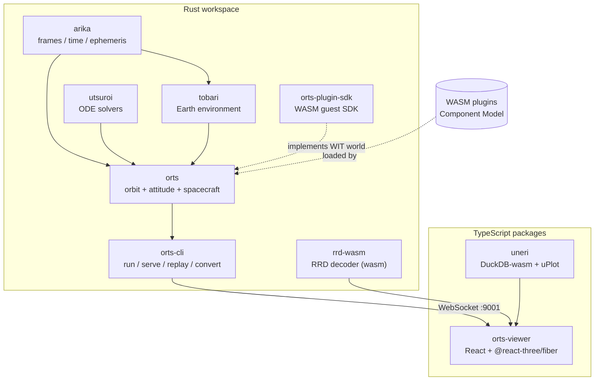
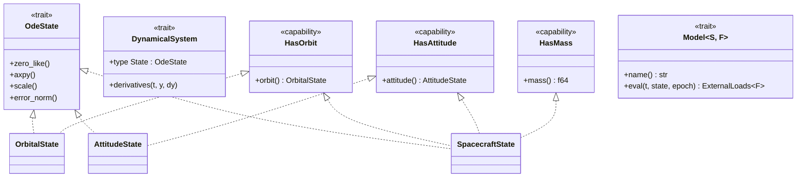
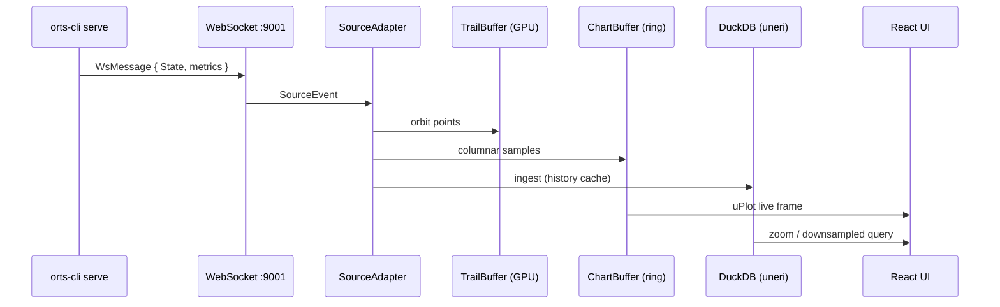

# Architecture

> 日本語版: [ARCHITECTURE.ja.md](ARCHITECTURE.ja.md)

## 1. Overview

orts is split into a Rust workspace (simulation core + CLI + plugin SDK) and
a TypeScript side (real-time 3D viewer + streaming charts). The two talk over
WebSocket when running live, or over files (RRD / CSV) for replay.

## 2. Rust workspace layering

| Layer | Crate | Responsibility |
|-------|-------|----------------|
| Foundation | [`utsuroi`](utsuroi/) | Generic ODE solvers (RK4, DOP853, Dormand-Prince, Störmer-Verlet, Yoshida). Exposes `OdeState`, `DynamicalSystem`. |
| Foundation | [`arika`](arika/) | Typed coordinate frames (ECI / ECEF / IAU), time scales (UTC / TT / TDB / TAI), Meeus analytic ephemerides, JPL Horizons fetcher, WGS-84, EOP. |
| Environment | [`tobari`](tobari/) | Atmosphere models (Exponential, Harris-Priester, NRLMSISE-00), geomagnetic field (IGRF-14, tilted-dipole), space-weather providers (CSSI, GFZ). |
| Simulation | [`orts`](orts/) | `OrbitalState` / `AttitudeState` / `SpacecraftState`, unified `Model<S, F>` trait, `OrbitalSystem` / `AttitudeSystem` / `SpacecraftDynamics`, sensors, plugin host, Rerun `.rrd` output. |
| Application | [`orts-cli`](cli/) | `orts run` / `orts serve` / `orts replay` / `orts convert`. Embeds the viewer and exposes a WebSocket stream on port 9001. |
| Extension | [`orts-plugin-sdk`](plugin-sdk/) | Rust SDK for writing WASM plugin guest controllers (callback-style or main-loop style). |
| Bridge | [`rrd-wasm`](rrd-wasm/) | Rerun RRD decoder compiled to WebAssembly for in-browser replay. |

## 3. Core trait hierarchy

The simulation core is built on two ideas: a generic numerical-integration
abstraction from `utsuroi`, and a capability-based model system in `orts`
that lets the same perturbation model be reused across orbit-only, attitude-
only, and coupled spacecraft systems.

Key points:

- A `Model<S, F>` declares the state capabilities it needs via trait bounds
  on `S` (e.g. `impl<S: HasOrbit> Model<S>` for atmospheric drag,
  `impl<S: HasAttitude + HasOrbit> Model<S>` for gravity-gradient torque).
  The same implementation plugs into any system whose state satisfies those
  bounds.
- The `F: Eci` parameter selects the inertial frame of the returned
  `ExternalLoads<F>`, defaulting to `SimpleEci` so existing call sites need
  not be changed.
- Systems come in three flavors — `OrbitalSystem`, `AttitudeSystem`,
  `SpacecraftDynamics` — each a `DynamicalSystem` that bundles a state with
  `Vec<Box<dyn Model<S, F>>>`.

## 4. Plugin system

Guest controllers (attitude control laws, mode managers, etc.) run in a
WebAssembly sandbox so they can be written in any language that targets
WASI and the Component Model.

- **Interface:** WIT world at [`orts/wit/v0/orts.wit`](orts/wit/v0/orts.wit).
- **World exports** (guest → host): `metadata(config)`, `run(config)`,
  `current-mode()`.
- **World imports** (host → guest): `host-env` (geomagnetic field, logging),
  `tick-io` (`wait_tick`, `send_command`).
- **Per-tick contract:** the host supplies a `TickInput` (truth state +
  per-device sensor readings + actuator telemetry); the guest replies with
  a `Command` (per-MTQ dipole, per-wheel speed or torque, per-thruster
  throttle).
- **Runtime:** `wasmtime` with the Pulley interpreter plus
  `Config::consume_fuel()` for deterministic, host-independent execution.
- **Distribution:** `.wasm` (portable) and `.cwasm` (wasmtime-specific
  AOT-compiled).

Native Rust controllers share the same `DiscreteController` trait, so
swapping a WASM guest for a native implementation requires only a config
change.

## 5. Data flow (simulation → viewer)

- **Live path (hot):** `ChartBuffer` → uPlot directly. DuckDB is *not* on
  the live render path.
- **History path (cold):** `IngestBuffer` → DuckDB is the cache used for
  zoom, downsampling, and post-hoc queries. Eventually consistent with
  the ring buffer.
- **Source abstraction:** `WebSocketAdapter` / `CSVFileAdapter` /
  `RrdFileAdapter` all normalize into the same `SourceEvent` stream,
  so live and replay go through one pipeline.

## 6. Design principles

1. **Capability-based composition.** States declare what they provide
   (`HasOrbit`, `HasAttitude`, `HasMass`); models declare what they need.
   This is the mechanism that lets one drag implementation work under
   `OrbitalSystem` and `SpacecraftDynamics` without duplication.
2. **Type-safe coordinate frames.** `Vec3<F: Frame>` makes ECI / ECEF / Body
   distinct types so frame mix-ups are compile errors, not silent bugs.
3. **Monomorphization over dynamic dispatch on the hot path.** ODE state is
   fixed-size (6D / 7D / 13D+) so the integrator inlines tightly. Variable-N
   cases (constellations, flexible bodies) go through `GroupState<S: OdeState>`.
4. **Deterministic plugin execution.** Pulley interpreter + fuel budgeting
   makes guest behavior reproducible across hosts and CI environments.
5. **Source abstraction at the viewer edge.** Transport (WS / CSV / RRD) is
   normalized to a single `SourceEvent` type, so adding a new source only
   means implementing one adapter.

## 7. See also

- [DESIGN.md](DESIGN.md) — extended design intent (Japanese)
- [README.md](README.md) — installation, quick start, feature list
- [CLAUDE.md](CLAUDE.md) — guide for Claude Code working on this repo
- Docs site: <https://sksat.github.io/orts/>
- Per-crate `README.md` under [`orts/`](orts/), [`arika/`](arika/),
  [`utsuroi/`](utsuroi/), [`tobari/`](tobari/), [`uneri/`](uneri/),
  [`viewer/`](viewer/), [`plugin-sdk/`](plugin-sdk/)
