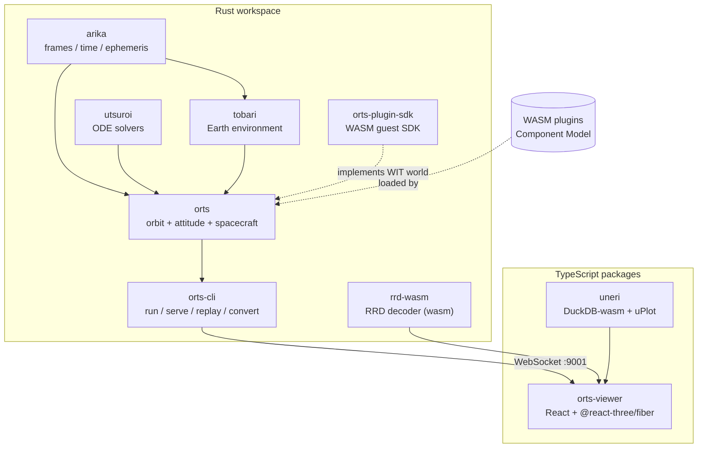
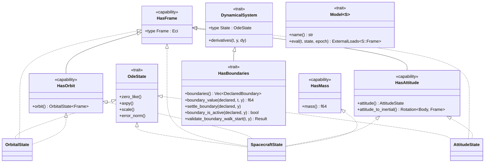
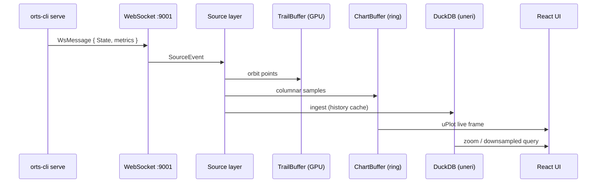

# Architecture

> 日本語版: [ARCHITECTURE.ja.md](ARCHITECTURE.ja.md)

## 1. Overview

orts is split into a Rust workspace (simulation core + CLI + plugin SDK) and
a TypeScript side (real-time 3D viewer + streaming charts). The two talk over
WebSocket when running live, or over files (RRD / CSV) for replay.

```mermaid
flowchart TB
  subgraph rust["Rust workspace"]
    utsuroi["utsuroi<br/>ODE solvers"]
    arika["arika<br/>frames / time / ephemeris"]
    tobari["tobari<br/>Earth environment"]
    orts["orts<br/>orbit + attitude + spacecraft"]
    cli["orts-cli<br/>run / serve / replay / convert"]
    sdk["orts-plugin-sdk<br/>WASM guest SDK"]
    rrdwasm["rrd-wasm<br/>RRD decoder (wasm)"]
  end
  subgraph ts["TypeScript packages"]
    uneri["uneri<br/>DuckDB-wasm + uPlot"]
    viewer["orts-viewer<br/>React + @react-three/fiber"]
  end
  wasm[(WASM plugins<br/>Component Model)]

  arika --> tobari
  arika --> orts
  utsuroi --> orts
  tobari --> orts
  orts --> cli
  sdk -. implements WIT world .-> orts
  wasm -. loaded by .-> orts
  cli -- WebSocket :9001 --> viewer
  rrdwasm --> viewer
  uneri --> viewer
```

## 2. Rust workspace layering

| Layer | Crate | Responsibility |
|-------|-------|----------------|
| Foundation | [`utsuroi`](utsuroi/) | Generic ODE solvers (RK4, DOP853, Dormand-Prince, Störmer-Verlet, Yoshida). Exposes `OdeState`, `DynamicalSystem`, and the root-event search (`RootEvent`, `RootSearch`) that locates a sign change in time. |
| Foundation | [`arika`](arika/) | Typed coordinate frames (ECI / ECEF / IAU), time scales (UTC / TT / TDB / TAI), Meeus analytic ephemerides, JPL Horizons fetcher, WGS-84, EOP. |
| Environment | [`tobari`](tobari/) | Atmosphere models (Exponential, Harris-Priester, NRLMSISE-00), spherical-harmonic geopotential (`SphericalHarmonicCoefficients`: ICGEM `.gfc` loader; `SphericalHarmonicField`: Holmes–Featherstone evaluator over a degree × order window), geomagnetic field (IGRF-14, tilted-dipole), space-weather providers (CSSI, GFZ). |
| Simulation | [`orts`](orts/) | `OrbitalState` / `AttitudeState` / `SpacecraftState`, unified `Model<S>` trait, `OrbitalSystem` / `AttitudeSystem` / `SpacecraftDynamics`, sensors, plugin host, Rerun `.rrd` output. |
| Application | [`orts-cli`](cli/) | `orts run` / `orts serve` / `orts replay` / `orts convert`. Embeds the viewer and exposes a WebSocket stream on port 9001. Resolves the propagation frame (`--frame simple-eci` / `gcrs`) into the generic orbit-only path; see `sim::frame::RunFrame`. |
| Extension | [`orts-plugin-sdk`](plugin-sdk/) | Rust SDK for writing WASM plugin guest controllers (callback-style or main-loop style). |
| Bridge | [`rrd-wasm`](rrd-wasm/) | Rerun RRD decoder compiled to WebAssembly for in-browser replay. |

## 3. Core trait hierarchy

The simulation core is built on two ideas: a generic numerical-integration
abstraction from `utsuroi`, and a capability-based model system in `orts`
that lets the same perturbation model be reused across orbit-only, attitude-
only, and coupled spacecraft systems.

```mermaid
classDiagram
  class OdeState {
    <<trait>>
    +zero_like()
    +axpy()
    +scale()
    +error_norm()
  }
  class DynamicalSystem {
    <<trait>>
    +type State : OdeState
    +derivatives(t, y, dy)
  }

  class HasFrame {
    <<capability>>
    +type Frame : Eci
  }
  class HasOrbit {
    <<capability>>
    +orbit() OrbitalState~Frame~
  }
  class HasAttitude {
    <<capability>>
    +attitude() AttitudeState
    +attitude_to_inertial() Rotation~Body, Frame~
  }
  class HasMass {
    <<capability>>
    +mass() f64
  }

  class Model~S~ {
    <<trait>>
    +name() str
    +eval(t, state, epoch) ExternalLoads~S::Frame~
  }

  class HasBoundaries {
    <<trait>>
    +boundaries() Vec~DeclaredBoundary~
    +boundary_value(declared, t, y) f64
    +settle_boundary(declared, y)
    +boundary_is_active(declared, y) bool
    +validate_boundary_walk_start(t, y) Result
  }

  OdeState <|.. OrbitalState
  OdeState <|.. AttitudeState
  OdeState <|.. SpacecraftState

  DynamicalSystem <|-- HasBoundaries

  HasFrame <|-- HasOrbit
  HasFrame <|-- HasAttitude

  HasFrame <|.. OrbitalState
  HasFrame <|.. AttitudeState
  HasFrame <|.. SpacecraftState
  HasOrbit <|.. OrbitalState
  HasOrbit <|.. SpacecraftState
  HasAttitude <|.. AttitudeState
  HasAttitude <|.. SpacecraftState
  HasMass <|.. SpacecraftState
```

Key points:

- A `Model<S>` declares the state capabilities it needs via trait bounds
  on `S` (e.g. `impl<S: HasFrame + HasOrbit> Model<S>` for atmospheric drag,
  `impl<S: HasFrame + HasAttitude + HasOrbit> Model<S>` for gravity-gradient
  torque). The same implementation plugs into any system whose state satisfies
  those bounds.
- `HasFrame::Frame` is the inertial frame the state is propagated in, declared
  once and shared by `HasOrbit` and `HasAttitude` as their supertrait. A model
  returns `ExternalLoads<S::Frame>`: the frame it reports loads in *is* the
  frame it read the state in, so the two cannot disagree. A model carrying a
  frame of its own binds it to the state's with an equality bound, which is
  where such a bound says something: because it needs a capability of the frame
  (`impl<F: EarthFixedTransform, S: HasFrame<Frame = F> + HasOrbit> Model<S> for
  AtmosphericDrag<F>`, and likewise `SphericalHarmonicGravity<F>`, whose
  longitude-dependent terms are rotated through `F`'s Earth-fixed chain), or
  because it holds frame-typed data
  (`ConstantThrust<F>` stores its Δv as a `Vec3<F>`). A requirement that is a
  property of the frame's *axes* is written per frame instead: `ConstantThrust`
  holds its direction fixed for a whole burn, which the of-date `Cirs` and
  `Teme` cannot honour, so it implements `Model` for `SimpleEci` and `Gcrs`
  rather than for every `F: Eci`.
- Systems come in three flavors — `OrbitalSystem`, `AttitudeSystem`,
  `SpacecraftDynamics` — each a `DynamicalSystem` that bundles a state with
  `Vec<Box<dyn Model<S>>>`.
- `SpacecraftDynamics` keeps the models that burn propellant in a list of their
  own (`with_propulsion`) next to the ordinary ones (`with_model`), because
  they are the ones a `PropellantPool` switches off. The pool is a
  `StateEffector` that carries no continuous state: what it holds is the
  discrete mode that says whether the tank is empty, and the boundary the
  propagation locates when it runs dry. Mass flow or a model's name would be a
  guess at which models to stop; the separate list is the answer, and the
  telemetry breakdowns read the same mode so a record cannot show thrust the
  trajectory never had.
- A system that carries one-sided constraints also implements `HasBoundaries`:
  it answers which boundaries exist, what each one's margin is at a state
  (positive ahead of it, zero on it, negative past it), and what to put on the
  bound once one is located. Every method has a default, so a system without
  constraints writes `impl HasBoundaries for X {}`. It also says whether a
  state is one its constraints can be propagated from: a mass below a
  propellant floor, or a wheel past its limit, is refused rather than settled,
  since settling it would add propellant the input never had or turn the body
  at a rate nobody asked for. Each effector answers about its own part
  (`StateEffector::validate_state`).
- `orts::boundary::walk_to_target` is the one loop every propagation path runs:
  it settles what a state is already past, switches the active boundaries for
  the modes the state is in, and steps with utsuroi's root search watching the
  margins. Where it stops is a boundary time located by bisection, and the
  system settles it there. The paths that share it are `IndependentGroup`,
  `CoupledGroup`, the CLI's controlled propagation, and `AugmentedAttitudeSystem`.
- The discrete side of a constraint lives in the state
  (`AugmentedState::modes`), not in a comparison inside the right-hand side: a
  search re-steps the same interval at several widths, and a comparison would
  flip between those steps and converge on the wrong time.

## 4. Plugin system

Guest controllers (attitude control laws, mode managers, etc.) run in a
WebAssembly sandbox so they can be written in any language that targets
WASI and the Component Model.

- **Interface:** WIT world at [`orts/wit/v0/orts.wit`](orts/wit/v0/orts.wit).
- **World exports** (guest → host): `metadata(config)`, `run(config)`,
  `current-mode()`.
- **World imports** (host → guest): `host-env` (geomagnetic field, logging),
  `tick-io` (`wait_tick`, `send_command`).
- **Per-tick contract:** the host supplies a `TickInput` (truth state +
  per-device sensor readings + actuator telemetry); the guest replies with
  a `Command` (per-MTQ dipole, per-wheel speed or torque, per-thruster
  throttle).
- **Runtime:** `wasmtime` with the Pulley interpreter for deterministic,
  host-independent execution.
- **Distribution:** `.wasm` (portable).

WASM guests are driven through the `PluginController` trait; built-in
native controllers implement the separate `DiscreteController` trait.
Unifying the two is planned — see [ROADMAP.md](ROADMAP.md).

## 5. Data flow (simulation → viewer)

```mermaid
sequenceDiagram
  participant sim as orts-cli serve
  participant ws as WebSocket :9001
  participant src as Source layer
  participant trail as TrailBuffer (GPU)
  participant chart as ChartBuffer (ring)
  participant duck as DuckDB (uneri)
  participant ui as React UI

  sim->>ws: WsMessage { State, metrics }
  ws->>src: SourceEvent
  src->>trail: orbit points
  src->>chart: columnar samples
  src->>duck: ingest (history cache)
  chart->>ui: uPlot live frame
  duck->>ui: zoom / downsampled query
```

- **Live path (hot):** `ChartBuffer` → uPlot directly. DuckDB is *not* on
  the live render path.
- **History path (cold):** `IngestBuffer` → DuckDB is the cache used for
  zoom, downsampling, and post-hoc queries. Eventually consistent with
  the ring buffer.
- **A chart column is declared per path:** the live ring buffer copies only
  its registered columns, and the DuckDB path needs the column, a `derived`
  pass-through for the query to select, and a value per insert. A column
  missing from any of these yields an empty chart rather than an error, so a
  new chart metric is added to every one of them at once. A column that can be
  absent asks the query for NaN (`COALESCE(col, 'NaN'::DOUBLE)`) so the chart
  draws a gap: what a NULL double becomes in the `Float64Array` the store
  hands over is a detail of Arrow's export, and a 0 there reads as a measured
  value.
- **Source abstraction:** every input normalizes into the same
  `SourceEvent` stream, so live and replay go through one pipeline.
  The live WebSocket path bridges through the `useWebSocket` hook
  (`useWebSocketSource`); file replay (`CSVFileAdapter` /
  `RrdFileAdapter`) parses off the main thread in Web Workers.
- **Two views, shared primitives:** the `./lib` entry exposes an orbit view
  (`OrbitViewer` → `OrbitScene` → `OrbitSceneContents`) and an attitude view
  (`AttitudeViewer` → `AttitudeScene` → `AttitudeSceneContents`), each a
  batteries-included wrapper over a bring-your-own-Canvas scene graph over an
  internal renderer. They share the display-frame transform (`displayFrame.ts`)
  and `SpacecraftVisual` rather than the scene graph — see [DESIGN.md](DESIGN.md) for why.
  `DirectionArrows` is written to the same contract and drawn today by the
  attitude view; the orbit view picks it up in a follow-up.

## 6. Design principles

1. **Capability-based composition.** States declare what they provide
   (`HasOrbit`, `HasAttitude`, `HasMass`); models declare what they need.
   This is the mechanism that lets one drag implementation work under
   `OrbitalSystem` and `SpacecraftDynamics` without duplication.
2. **Type-safe coordinate frames.** `Vec3<F: Frame>` makes ECI / ECEF / Body
   distinct types so frame mix-ups are compile errors, not silent bugs.
3. **Monomorphization over dynamic dispatch on the hot path.** ODE state is
   fixed-size (6D / 7D / 14D, plus auxiliary state via `AugmentedState`) so
   the integrator inlines tightly. Variable-N cases (constellations,
   flexible bodies) go through `GroupState<S: OdeState>`.
4. **Deterministic plugin execution.** The Pulley interpreter makes guest
   behavior reproducible across hosts and CI environments.
5. **Source abstraction at the viewer edge.** Transport (WS / CSV / RRD) is
   normalized to a single `SourceEvent` type, so adding a new source only
   means implementing one adapter.

## 7. See also

- [DESIGN.md](DESIGN.md) — extended design intent (Japanese)
- [ROADMAP.md](ROADMAP.md) — planned but unimplemented work (Japanese)
- [README.md](README.md) — installation, quick start, feature list
- [CLAUDE.md](CLAUDE.md) — guide for Claude Code working on this repo
- Docs site: <https://sksat.github.io/orts/>
- Per-crate `README.md` under [`orts/`](orts/), [`arika/`](arika/),
  [`utsuroi/`](utsuroi/), [`tobari/`](tobari/), [`uneri/`](uneri/),
  [`viewer/`](viewer/), [`plugin-sdk/`](plugin-sdk/)
