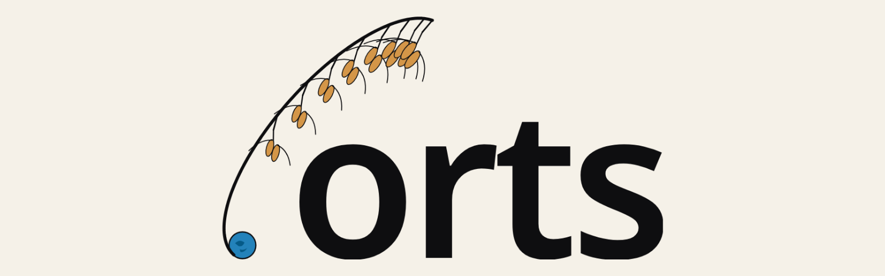

<p align="center">
  
</p>

[](https://crates.io/crates/orts)
[](https://github.com/sksat/orts/actions/workflows/ci.yml)
[](https://docs.rs/orts)
[](https://sksat.github.io/orts/)
[](LICENSE)
[](https://deepwiki.com/sksat/orts)

**orts** is an astrodynamics simulation platform — orbit and attitude dynamics with real-time 3D visualization, extensible WASM plugins, and in-browser analytics.

## Features

- N-body orbital simulation with adaptive (DOP853, Dormand-Prince) and symplectic (Störmer-Verlet, Yoshida) integrators
- Gravity models: point-mass, zonal harmonics (J2, J3, J4), full spherical-harmonic geopotential from ICGEM `.gfc` files (EGM96 / EGM2008 / EIGEN-class, Holmes–Featherstone, validated against Orekit to 1e-13 pointwise and ~1 m over 24 h at 70×70)
- Perturbations: atmospheric drag, solar radiation pressure, third-body gravity, constant
  thrust. Drag and SRP can be attitude-dependent, from a flat-panel surface that also
  produces disturbance torques
- Atmosphere models: Exponential, Harris-Priester, NRLMSISE-00
- Geomagnetic field: IGRF-14 spherical harmonic expansion + tilted-dipole approximation
- Space weather: CSSI and GFZ providers (F10.7, Ap, Kp)
- IAU 2006/2000A CIO-based Earth rotation with typed coordinate frames and EOP
- Celestial body ephemerides (Meeus analytic + JPL Horizons)
- Attitude dynamics and control: reaction wheels, magnetorquers, B-dot / PD controllers
- Sensor models: magnetometer, gyroscope, sun sensor, star tracker (with noise)
- WASM Component Model plugin runtime for guest controllers via wasmtime
- CLI with embedded 3D viewer, WebSocket telemetry, and format conversion
- Real-time charting with DuckDB-wasm + uPlot (uneri library)
- Rerun `.rrd` data format for recording and replay

## Installation

```bash
# From source
cargo install orts-cli

# Pre-built binary (cargo-binstall)
cargo binstall orts-cli
```

## Quick Start

```bash
# Run a simulation (auto-detects orts.toml in current directory)
orts run

# WebSocket server with embedded 3D viewer
orts serve --config orts.toml
# Open http://localhost:9001

# Replay a recorded simulation
orts replay output.rrd

# Convert between formats
orts convert output.rrd --format csv
```

Example config (`orts.toml`). It points at a controller plugin, so build one
first. The plugin sources ship in this repository, so this part needs a
checkout — from its root:

```bash
cargo install cargo-component
rustup target add wasm32-wasip1
cargo component build --release \
  --manifest-path plugin-sdk/examples/pd-rw-control/Cargo.toml
```

```toml
body = "earth"
dt = 0.01
duration = 120.0

[[satellites]]
id = "sat-1"
sensors = ["gyroscope", "star_tracker"]

[satellites.orbit]
type = "circular"
altitude = 400

[satellites.attitude]
inertia_diag = [10, 10, 10]
mass = 500

[satellites.reaction_wheels]
type = "three_axis"
inertia = 0.01
max_momentum = 5.0
max_torque = 0.5

# PD attitude control: hold the identity quaternion using the wheels.
[satellites.controller]
type = "wasm"
path = "plugin-sdk/examples/target/wasm32-wasip1/release/orts_example_plugin_pd_rw_control.wasm"
```

`path` is resolved against the working directory, so run `orts` from the
repository root too, or make it absolute.

The controller is what reads the sensors and commands the wheels. Drop it and
`orts run` propagates orbit and attitude, and warns that the `sensors` and
`reaction_wheels` blocks have no effect.

### WASM Plugin

Write satellite attitude controllers in any language that compiles to WebAssembly.
Plugins receive sensor readings (magnetometer, gyroscope, star tracker, etc.) each tick and return actuator commands (reaction wheels, magnetorquers) — the simulator handles all dynamics and environment models.

The quick start above builds and wires up `pd-rw-control`. Its gains and the
attitude it holds come from `[satellites.controller.config]`, which every field
defaults so it can be omitted:

```toml
[satellites.controller.config]
kp = 1.0
kd = 2.0
target_q = [1.0, 0.0, 0.0, 0.0]
sample_period = 0.1
```

See [plugin-sdk/examples/](https://github.com/sksat/orts/tree/main/plugin-sdk/examples) for more plugin examples,
and [examples/](https://github.com/sksat/orts/tree/main/orts/examples) for
Apollo 11, Artemis 1, and orbital lifetime analysis demos.

## Project Structure

### Rust crates

| Crate | Directory | Description |
|-------|-----------|-------------|
| `orts` | `orts/` | Core simulation: dynamics, force/torque models, sensors, plugin host |
| `orts-cli` | `cli/` | CLI binary with embedded viewer + WebSocket server |
| `orts-plugin-sdk` | `plugin-sdk/` | SDK for writing WASM plugin guest controllers |
| `arika` (在処) | `arika/` | Coordinate frames, epochs, Earth rotation, ephemerides |
| `utsuroi` (移ろい) | `utsuroi/` | ODE integrators (RK4, DOP853, Störmer-Verlet, Yoshida) |
| `tobari` (帳) | `tobari/` | Atmosphere density, spherical-harmonic geopotential, IGRF geomagnetic field, space weather |
| `rrd-wasm` | `rrd-wasm/` | Rerun RRD decoder compiled to WebAssembly |

### TypeScript / npm packages

| Package | Directory | Description |
|---------|-----------|-------------|
| `uneri` (うねり) | `uneri/` | DuckDB-wasm + uPlot streaming time-series charts |
| `orts-viewer` | `viewer/` | Real-time 3D orbit viewer (React + @react-three/fiber) |
| `starlight-rustdoc` | `starlight-rustdoc/` | Astro/Starlight plugin for Rust API docs from rustdoc JSON |

### Example plugins (`plugin-sdk/examples/`)

| Plugin | Style | Description |
|--------|-------|-------------|
| `bdot-finite-diff` | main-loop | B-dot detumbling via finite-difference dB/dt |
| `pd-rw-control` | callback | PD attitude control + reaction wheels |
| `pd-rw-unloading` | callback | PD control + magnetorquer RW unloading |
| `detumble-nadir` | callback | Detumble → nadir pointing mode transition |

## Documentation

- [Docs site](https://sksat.github.io/orts/) — API reference, examples, guides
- [ARCHITECTURE.md](ARCHITECTURE.md) / [日本語](ARCHITECTURE.ja.md) — Top-level architecture overview
- [DESIGN.md](DESIGN.md) — Design document (Japanese)
- [CHANGELOG.md](CHANGELOG.md) — English changelog
- [CHANGELOG.ja.md](CHANGELOG.ja.md) — Japanese changelog
- [RELEASING.md](RELEASING.md) — Release process

## License

MIT
