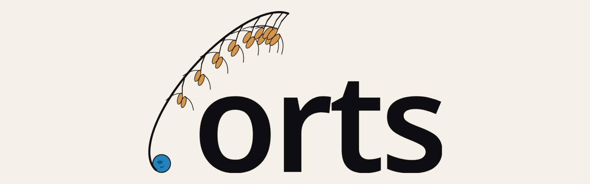

# orts brand assets

## SVG
- `orts-icon-light.svg` / `orts-icon-dark.svg` — icon (square, 320×320 viewBox, transparent background)
- `orts-wordmark-light.svg` / `orts-wordmark-dark.svg` — icon + text, with a baked-in background fill (paper / ink)
- `orts-wordmark-on-light.svg` / `orts-wordmark-on-dark.svg` — icon + text, transparent background (use on light / dark backgrounds in web UIs)

## Raster
- `orts-header.png` — banner for README headers
- `favicon.ico` — multi-size (16/32/48, light variant)

## Colors
- ink   `#0E0E10`
- paper `#F5F1E8`
- blue  `oklch(0.58 0.12 240)` (≈ `#2e6db0`)
- amber `oklch(0.72 0.12 70)`  (≈ `#c98a4f`)

## Usage notes
- Minimum clear space: at least 1/8 of the logo height
- Below 32 px the cluster detail collapses; use the icon alone at small sizes
- Do not alter colors, proportions, or rotation
