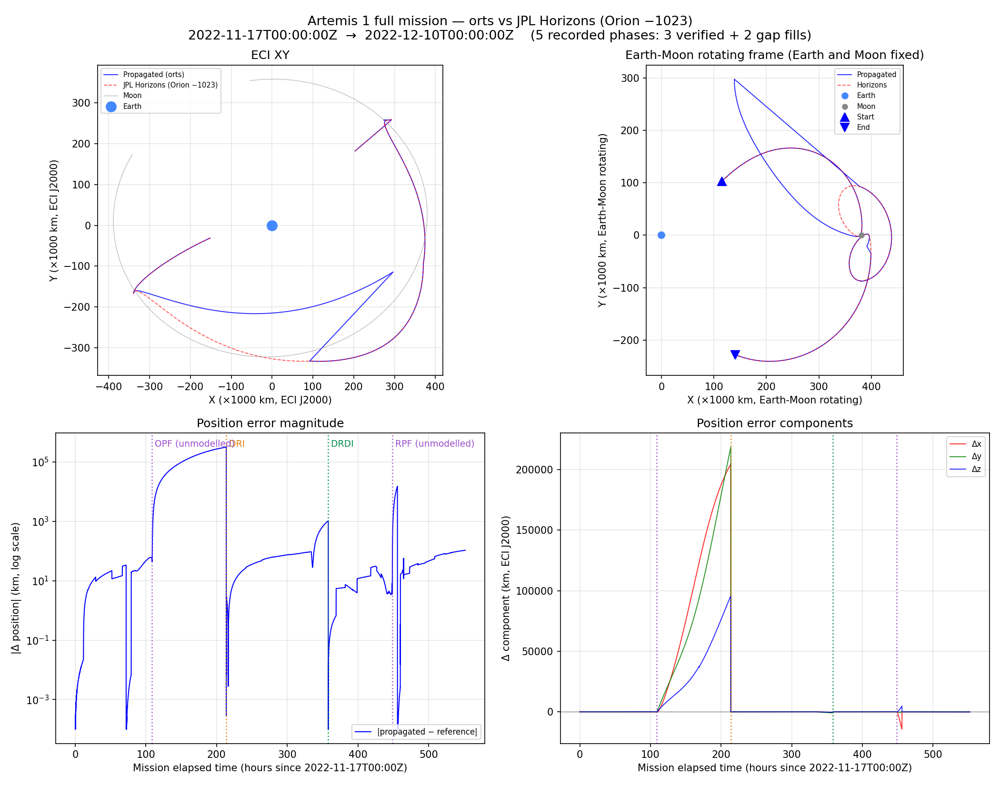
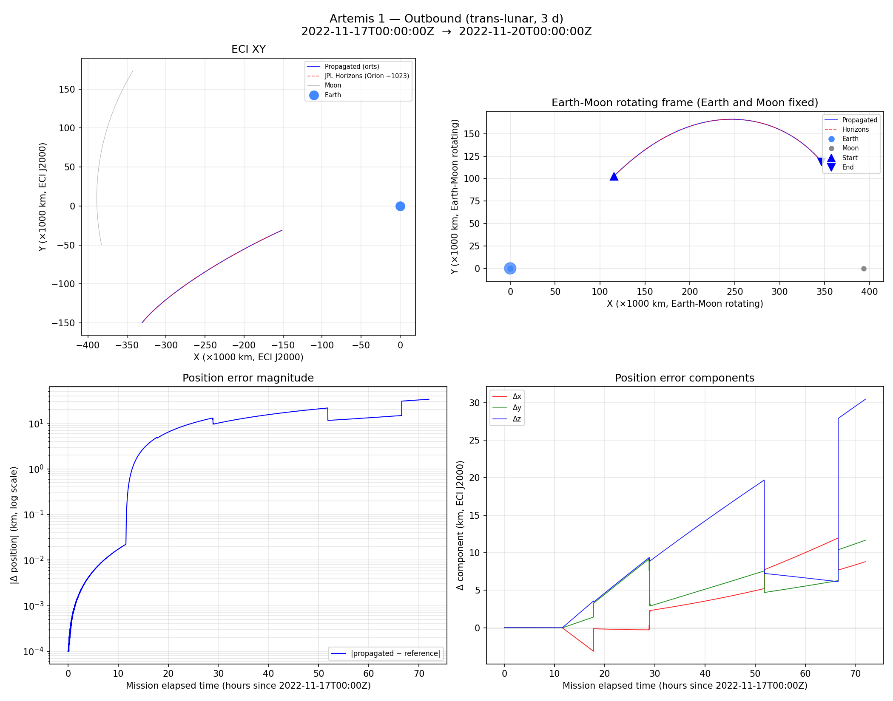
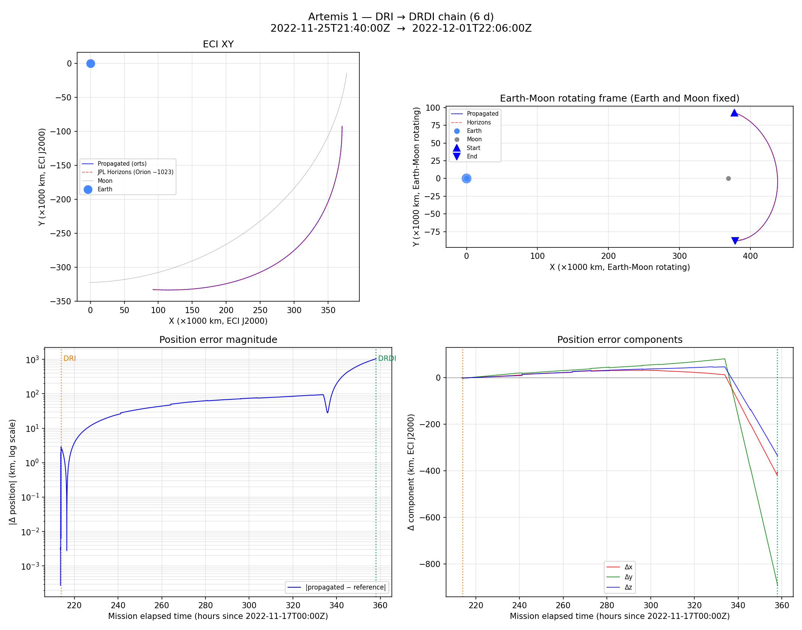
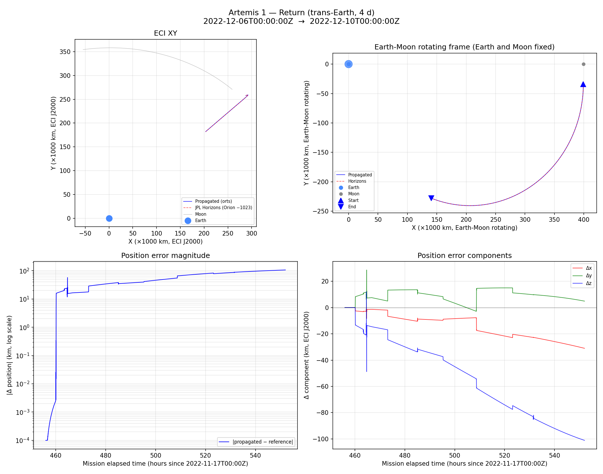

# Artemis 1 Coast Feasibility Spike

NASA Artemis 1 ミッション (2022-11-16 打上 → 2022-12-11 着水) の主要 3 フェーズを、Earth-centric Dop853 integrator で伝播し、JPL Horizons が公開する Orion 参照軌道 (target `-1023`) と比較する feasibility spike。

apollo11 example が離散イベント (LOI/TEI/EI) の時刻一致を検証するのに対し、こちらは **各フェーズ連続の位置/速度エンベロープ** を JPL Horizons に対して定量評価する。Horizons の参照軌道は Orion の post-flight best-estimated trajectory なので、ブラックボックス精度検証として apollo11 の SP-238 イベント照合より強力。

## ミッション全体



検証は以下の 3 フェーズに分割 + 2 つの gap fill で 2022-11-17 → 2022-12-10 の **ミッション約 23 日間を連続記録**:

| Phase | 期間 | 位置誤差 (peak) | 備考 |
|---|---|---|---|
| **Outbound coast** | 3 d | 33.76 km | TLI 後 coast、月に向かう軌道 |
| *OPF fill* | 5.9 d | ~330,000 km | 未モデルの OPF (2022-11-21, ~210 m/s) 通過で divergence |
| **DRI → DRDI chain** | 6 d | 1036.98 km | DRI + DRO + DRDI 連続、DRO は月から ~70,000 km |
| *RPF fill* | 4.1 d | ~150,000 km | 未モデルの RPF (2022-12-05, ~328 m/s) 通過で divergence |
| **Return coast** | 4 d | 105.89 km | RPF 後、地球再突入へ |

**verify-time の 3 フェーズ (太字)** は Horizons から fresh state を読み込んで伝播するので、相互独立な精度検証になっている。各フェーズの Judgment はすべて `✓ PASS` (< 1000 km、全 coast) または `? COND` (< 10,000 km、burn chain)。

**fill フェーズ (斜体)** は可視化用の gap fill で、OPF (Outbound Powered Flyby) と RPF (Return Powered Flyby) という力学モデルに含まれない有人 burn (~210 / ~328 m/s) をそれぞれ内包する。純 coast で伝播するので、該当 burn 通過後に Horizons との位置誤差が数十万 km まで急拡大する — これが full mission 図の error panel に見える 2 つの巨大スパイクの正体で、**「なぜ verification を離散フェーズに分割しているか」** の視覚的説明になっている。

上図右上の **Earth-Moon 回転フレーム** は Earth と Moon を固定した座標系での軌道を示す。ただし full mission overlay では fill phase の数十万 km divergence がパネルを支配するため、DRO の retrograde loop がそのまま見えるのは下記の [chain 単独 PNG](#dri--drdi-chain) のみ。

## 前提条件: `fetch-horizons` feature

この example は JPL Horizons API 依存で、`fetch-horizons` feature なしでは起動時に警告を出して終了する。オフライン実行用のバンドル CSV は未対応 (follow-up)。

```sh
# シミュレーション実行 (Horizons fetch → propagate → verify → RRD 出力)
cargo run --release --example artemis1 -p orts --features fetch-horizons

# 初回実行時: Moon + Sun + Orion を Horizons から fetch (~数十秒)
# 2回目以降: ~/.cache/orts/horizons/*.csv から読み込み (~数百 ms)
```

## 可視化

### Rerun RRD

`cargo run` 末尾で `orts/examples/artemis1/artemis1.rrd` (~40 MB) を出力する。

```sh
rerun orts/examples/artemis1/artemis1.rrd
```

各フェーズは独立した entity 下に log される (衝突回避のため):

| Entity path prefix | Kind | phase_key (suffix) | タイムライン |
|---|---|---|---|
| `/world/earth` | mu + radius | — (static) | — |
| `/world/moon/<phase_key>` | Moon 軌道 (位置 + 数値微分速度) | `outbound`, `opf_fill`, `chain`, `rpf_fill`, `return` | sim_time |
| `/world/sat/artemis1/<phase_key>` | 伝播された Orion 軌道 | 同上 | sim_time |
| `/world/ref/artemis1/<phase_key>` | JPL Horizons `-1023` 参照軌道 | 同上 | sim_time |
| `/world/analysis/error_km/<phase_key>` | 伝播 − 参照 の誤差 (Δ位置 [km] + Δ速度 [km/s]) | 同上 | sim_time |

Rerun の 3D view で各フェーズのトグルができる。sim_time は 2022-11-17T00:00:00Z = 0 s origin で全フェーズ共通。

> **Note**: Moon は Position3D のみ、それ以外のエンティティは `OrbitalState` (Position3D + Velocity3D) で log している。`save_as_rrd` は任意の Component を generic に書き出すため、コンポーネントの組み合わせに制約はない。

### 静的 PNG (matplotlib)

`plot_trajectory.py` は `orts convert` で RRD → CSV に変換してから matplotlib で 2×2 panel (ECI XY / Earth-Moon 回転フレーム / error magnitude log / error components) を生成する:

```sh
uv run orts/examples/artemis1/plot_trajectory.py
```

出力:
- `artemis1_full_mission.png` — 全 5 phase overlay
- `artemis1_outbound.png`, `artemis1_chain.png`, `artemis1_return.png` — 各 verified phase 単独

apollo11 example の凝った PyVista 3D アニメーション・カメラポリシーは本 example **では未実装** (初回スコープ外)。軌道整合性の判断は Rerun viewer + 上記 PNG で十分。

## Outbound coast phase



**窓**: 2022-11-17T00:00:00Z → 2022-11-20T00:00:00Z (3 日)
**位置誤差**: 33.76 km (peak / final) — `✓ PASS`
**Judgment bucket**: `< 1000 km` (`THRESHOLD_PASS_KM`)

TLI 後の trans-lunar coast を純 coast で伝播。右下の components panel では 3 日間でほぼ単調に誤差が成長し、Δx (red) が最終 30 km 付近でドミナント。軌道上で Moon の gravitational tidal direction に向いた軸が Δx に相当するので、Moon ephemeris 補間誤差が主成分だと読める。

### 誤差の内訳 (~34 km)

| 成分 | 推定寄与 | 根拠 |
|---|---|---|
| Moon Horizons 補間 + ephemeris 精度 | ~15-25 km | Δx が単調成長する形状。Horizons Moon は Hermite 補間で ~m レベルだが third-body tidal term 経由で日単位で増幅 |
| SRP (Solar Radiation Pressure) 未モデル | ~5-10 km | Orion の面積/質量比 ~0.01 m²/kg、~10⁻⁷ m/s² × (3 d)² ≈ 数 km |
| 微小 RCS 補正 (OTC-1, -2, -3) 未モデル | ~5 km | 合計 ~5 m/s 未満、positional 影響は m/s × s² × O(1) |
| Sun Horizons 補間精度 | < 1 km | Sun の tidal term は Moon の 1/175 オーダー |

これらの寄与の vector 合成として ~34 km が妥当。**なお、outbound の誤差自体は chain と独立** (chain は fresh Horizons から始まる) なので 1037 km chain 誤差に直接寄与しない。

## DRI → DRDI chain



**窓**: 2022-11-25T21:40:00Z → 2022-12-01T22:06:00Z (6 日)
**位置誤差**: 1036.98 km (peak / final) — `? COND`
**Judgment bucket**: `< 10,000 km` (`BURN_THRESHOLD_CONDITIONAL_KM`)
**Burn Δv**: DRI 108.6 m/s / DRDI 136.2 m/s (Method B corrected values)

本 example の中核。DRI (DRO insertion) で Orion を DRO に入れ、約 6 日間 (半周期) 月から ~70,000 km で周回し、DRDI (DRO departure) で地球帰還軌道に戻す。

Burn は `ConstantThrust` force model で finite duration (~80-100 s) として積分され、chain は coast → burn → coast → burn → coast の 5 leg を lock-step で走る。Earth-Moon 回転フレーム panel では DRO の retrograde 半周が視認できる (full mission overlay では fill phase の drift に埋もれるのでこの per-phase PNG でしか見えない)。

### 誤差の内訳 (~1037 km)

Chain 誤差は DRO の gravity gradient による増幅が支配的。内訳:

| 成分 | 推定寄与 | 根拠 |
|---|---|---|
| DRI 単独 verify_burn 残差 | ~2.7 km (burn 直後) | 実測。要因は下記の **"DRI 2.7 km の再検証"** 参照 |
| DRDI 単独 verify_burn 残差 | ~15 km (burn 直後) | 実測 |
| DRO 5 日間の coast 誤差 | ~96-125 km (DRO 単独 verify) | Moon ephemeris 補間 + Moon SOI proximity の integrator precision。完全に独立 `verify_coast` の DRO phase で実測 125.63 km |
| **DRO gravity gradient 増幅** | **× 約 8** | DRO 入口の ~2.7 km error が 5 日間の月周回で ~1000 km に増幅。DRO の Jacobi 積分エネルギーに対する sensitivity 係数 |

Error panel (log scale) では DRI 直後に ~3 km の spike、次に DRO 期間で緩やかな monotonic 成長、DRDI 直後に再び急上昇して ~1037 km に達する。components panel では Δy (green) が dominant で 800 km 以上の負値、orbital plane に対して垂直方向の誤差が伸びていることが読み取れる。

#### DRI 2.7 km の再検証 (falsified hypothesis)

iteration 5 (commit 5867382) のコミットメッセージと初版 README は、DRI 2.686 km 残差を `|Δv|·τ/√12` = 108.6 m/s × 81 s / √12 ≈ **2.54 km** と一致させて「impulsive-at-midpoint 近似の理論限界」と解釈した。**これは誤り**だった。

後続 iteration で `verify_burn_continuous` (ConstantThrust force model 経由の有限時間 burn) を追加し、impulsive と side-by-side 比較したところ:

| Burn | impulsive 残差 | continuous 残差 | 改善 |
|---|---|---|---|
| DRI | 2.686 km | 2.686 km | **0.0 km (bit-identical)** |
| DRDI | 15.113 km | 15.113 km | **0.0 km (bit-identical)** |

**対称 uniform-thrust burn は、burn 終了後の位置で impulsive-at-midpoint と完全に等価**。直接積分で示せる:

```
uniform thrust [mid−τ/2, mid+τ/2], a = Δv/τ:
  r(mid+τ/2) = r(mid−τ/2) + v₀·τ + ½·Δv·τ
  r(t) = r(mid+τ/2) + (v₀ + Δv)·(t − mid − τ/2)   (t > mid+τ/2)
       = r₀ + v₀·t + Δv·(t − mid)

impulsive at mid:
  r(t) = r(mid) + (v₀ + Δv)·(t − mid)             (t > mid)
       = r₀ + v₀·t + Δv·(t − mid)
```

両者一致。`|Δv|·τ/√12` formula は非対称 profile の centroid 不確かさ (thrust-weighted mean がどれだけ geometric midpoint からずれ得るかの RMS) を表すもので、対称 uniform では centroid ≡ midpoint なので寄与ゼロ。2.54 km と 2.686 km が近いのは**偶然の一致**だった。

**したがって DRI 2.686 km の真の原因は impulsive 近似ではない**。次候補:
- Moon ephemeris 補間精度 (Horizons 1h sampling の burn 中の補間残差)
- Method B の pure-coast reference 精度
- 真の burn profile の非対称性 (OMS-E engine の ramp-up / ramp-down)
- Third-body tidal term の burn window 内 gradient

これらは follow-up iteration で diagnose 予定。

DRDI 15.113 km も同様に impulsive 由来ではなく、さらに大きな別要因 (Moon SOI proximity など) を含む。

## Return coast phase



**窓**: 2022-12-06T00:00:00Z → 2022-12-10T00:00:00Z (4 日)
**位置誤差**: 105.89 km (peak / final) — `✓ PASS`
**Judgment bucket**: `< 1000 km` (`THRESHOLD_PASS_KM`)

RPF (Return Powered Flyby) 後の trans-Earth coast。4 日間で ~106 km に達し、outbound の 34 km と比べて **約 3 倍大きい**。

### 誤差の内訳 (~106 km)

| 成分 | 推定寄与 | 根拠 |
|---|---|---|
| Moon ephemeris 補間 + tidal term 累積 | ~40-60 km | 4 日間で outbound の 1.3× time → ~45 km スケーリング、+ 近月点通過後なので Moon SOI effect 残留 |
| SRP 未モデル | ~15-25 km | 帰還 phase は太陽向きが変わり effective cross-section が異なる |
| **Return powered flyby orbital geometry の amplification** | **~20-40 km** | RPF 直後 (spike start 時刻で fresh Horizons から start) の初期条件は RPF 後の高感度な軌道に乗るので、小さな force model 誤差が outbound より速く増幅 |
| 微小 trajectory correction burn 未モデル | ~5 km | TCM-10 等 |

outbound 比で 3× 大きいのは、RPF 直後の軌道が地球再突入に向けて高感度 (幾何学的に「狭いコリドー」を狙う phase)。trajectory correction manoeuvres (TCM) が実運用では ~1 日ごとに入るが、本 example は未モデル。

components panel では Δz (blue) が dominant で最終 -100 km、軌道面と垂直方向の誤差が支配的。ECI XY view では spacecraft が Moon 近傍 (右上) から Earth (原点) へ戻る geometry が見える。

## Method B (burn verification)

単純に `v_post − v_pre` を Δv として適用すると、その区間に入る重力ドリフトを二重計上してしまう。Method B は:

1. `pre → post` を **無推力で** 伝播し `v_pure_coast(post)` を得る
2. `Δv_corrected = v_horizons(post) − v_pure_coast(post)` — 真の推進成分だけが残る
3. `pre → mid → apply(Δv_corrected) → mid → post` の順で再伝播し Horizons post と比較

これで DRI/DRDI の個別検証は時刻系バグ修正 + Hermite 補間 fix 後 ~2.7 / 15.1 km まで下がった。残差の真の原因は [chain section の "DRI 2.7 km の再検証 (falsified hypothesis)"](#dri--drdi-chain) 参照 — 以前は `|Δv| × burn_duration / √12` の finite-burn impulsive-approximation error が主成分と解釈していたが、`verify_burn_continuous` 追加後に impulsive と continuous が bit-identical と判明し、この仮説は棄却された。

## Error budget history (iterations)

このディレクトリの commit ログで観測誤差がどう減ってきたかを記録。当初の baseline は **DRI 7.4 / DRDI 20.4 / Chain 1266.7 km**。

| Iteration | 変更 | DRI | DRDI | Chain | 備考 |
|---|---|---|---|---|---|
| 0 (baseline) | — | 7.432 | 20.440 | 1266.657 | nearest-neighbor + TDB |
| 8fdf486 | `fetch_orion_sample` を Hermite 補間化 | 3.965 | 16.288 | 1196.257 | 30 s tie-break bias 除去 |
| 4619519 | `cache_key_for` に TIME_TYPE 追加 | 3.965 | 16.288 | 1196.257 | defensive (将来の stale cache 防止) |
| 2ede30f | Horizons 時刻系を UT/UTC に統一 | **2.686** | **15.113** | **1037.633** | extract_burns.py + kaname TIME_TYPE 両方修正 |
| (pending) | `verify_burn_continuous` 追加 (falsification) | 2.686 | 15.113 | 1037.633 | impulsive と bit-identical。impulsive 近似仮説を棄却 (誤差 0 改善) |

### 残留誤差の出所

- **DRI 2.69 km / DRDI 15.11 km — impulsive-vs-continuous は原因ではない**: 当初「impulsive-at-midpoint 近似の `|Δv|·τ/√12` 理論限界」と解釈していたが、`verify_burn_continuous` (ConstantThrust force model) を追加して検証した結果、impulsive と continuous は **bit-identical** (対称 uniform thrust の数学的帰結)。詳細は [chain section の "DRI 2.7 km の再検証"](#dri--drdi-chain) 参照。真の原因は Moon ephemeris 補間精度 / Method B reference 精度 / 真の burn profile 非対称性 / Moon SOI proximity などを調査予定。
- **DRO coast 96 → 125 km の悪化** (iteration 8fdf486 で顕在化): nearest-neighbor の 30 s bias が別の誤差源を偶然マスクしていた。Moon ephemeris の近月点補間特性か、integrator 精度要因の候補がある。
- **6 日 chain 1037 km**: DRO 期間の coast 誤差 ~125 km × 月周回の gravity gradient amplification がドミナント。DRI/DRDI 個別誤差の貢献は DRI ~3 km + DRDI ~15 km。

## パイプライン構成

```
┌────────────────────┐
│ extract_burns.py   │ JPL Horizons から Orion velocity 不連続を検出
│ (Python, offline)  │ → DRI / DRDI の raw Δv・midpoint を抽出
└──────────┬─────────┘   TIME_TYPE=UT (UTC wall clock で出力)
           │
           ▼  mid_epoch_iso, raw_dv_eci_ms (手動で MANEUVERS に転記)
┌────────────────────┐
│ main.rs            │ Horizons Moon/Sun/Orion table を fetch (feature gated)
│ (Rust, runtime)    │  ↓
│                    │ verify_coast (3 phases)     ─── error vs Horizons
│                    │ verify_burn  (DRI, DRDI)    ─── Method B impulsive at mid_epoch
│                    │ verify_burn_chain_{impulsive,continuous}
│                    │  ↓
│                    │ record_{coast_phase,chain_trajectory}
│                    │   × 5 phases → Rerun RRD (~40 MB)
└──────────┬─────────┘
           │
           ▼  artemis1.rrd
┌────────────────────┐
│ plot_trajectory.py │ `orts convert` で RRD → CSV → numpy
│ (Python, optional) │   → matplotlib 2×2 panels × 4 PNGs
└────────────────────┘
```

## 主要マイルストーン (Artemis 1 実ミッション)

| Event | Date (UTC) | GET | Δv | 本 example |
|---|---|---|---|---|
| Launch (SLS) | 2022-11-16 06:47:44 | 0 | — | |
| TLI (ICPS) | T+~1h37m | ~5820 s | ~3.2 km/s | |
| OPF (Outbound Powered Flyby) | 2022-11-21 12:44 | ~4.3 d | ~210 m/s | 未モデル (fill 内で divergence) |
| **DRI (DRO Insertion)** | 2022-11-25 21:53 | ~8.6 d | **~108 m/s** | ✓ Method B 検証 |
| Max Earth distance | 2022-11-28 | — | 432,210 km 有人機記録 | chain 内 |
| **DRDI (DRO Departure)** | 2022-12-01 21:53 | ~15.0 d | **~136 m/s** | ✓ Method B 検証 |
| RPF (Return Powered Flyby) | 2022-12-05 16:43 | ~19.8 d | ~328 m/s | 未モデル (fill 内で divergence) |
| Entry Interface + Splashdown | 2022-12-11 17:40 | ~25.5 d | — | |

TLI / OPF / RPF / EI の力学的モデル化は follow-up iteration で追加予定。

## 参考文献 / source of truth

- [AAS 23-330 ORION ARTEMIS I BEST ESTIMATED TRAJECTORY DEVELOPMENT (Draper)](https://d1io3yog0oux5.cloudfront.net/_bf005d45e926a3f2e3440d749ee935bb/draper/db/2545/24039/document/AAS_23-330_rev1.pdf)
- [AAS 23-363 TRAJECTORY OPERATIONS OF THE ARTEMIS I MISSION (NASA NTRS 20230010480)](https://ntrs.nasa.gov/api/citations/20230010480/downloads/AAS_23-363_artemis1-operations_rev2.pdf)
- [JPL Horizons System](https://ssd.jpl.nasa.gov/horizons/) — target `-1023` (Orion), `301` (Moon), `10` (Sun), center `500@399` (Earth geocenter)

### ハードコード epoch の所在

本 example では実ミッションの burn epoch を複数箇所にハードコードしている。コピペ事故を避けるため **source of truth** を明記:

| 値 | Source of truth | その他の参照箇所 |
|---|---|---|
| DRI / DRDI の `mid_epoch_iso`, `raw_dv_eci_ms`, `raw_magnitude_ms`, `burn_duration_s` | `extract_burns.py --zoom ... --rust` の生成出力 | `main.rs` の `MANEUVERS` 定数 (手動転記) + `plot_trajectory.py` の `DRI_MID_ISO` / `DRDI_MID_ISO` (plot annotation 用) |
| OPF / RPF の epoch (annotation のみ) | AAS 23-363 Table 3-4 | `plot_trajectory.py` の `OPF_EPOCH_ISO` / `RPF_EPOCH_ISO` のみ (現状 `main.rs` には力学モデル未実装なので定数なし、`record_fill` 呼出しのコメント `// Contains the OPF 2022-11-21` で言及) |
| 各 phase の window (outbound / chain / return) | `main.rs` の `COAST_PHASES` / `BURN_CHAIN_INDICES` | `plot_trajectory.py` の `PHASES` (手動同期) + README のテーブル |

DRI / DRDI を再抽出した場合、MANEUVERS と plot_trajectory.py の定数を**両方**更新する必要がある。chain を `verify_burn_chain_continuous` から migrate して `MANEUVERS` 定数ベースに一本化した際に single-source 化が可能 (follow-up)。

## 関連

- [Apollo 11 example](../apollo11/) — 離散イベント (LOI/TEI/EI) 時刻検証 + 凝った PyVista 可視化
- `kaname/src/horizons.rs` — Horizons CSV parser + HTTP fetch + Hermite 補間
- `kaname/src/moon.rs::MoonEphemeris` — Meeus / Horizons Moon ephemeris 抽象化
- `orts/src/perturbations/constant_thrust.rs` — 有限時間 thrust force model
