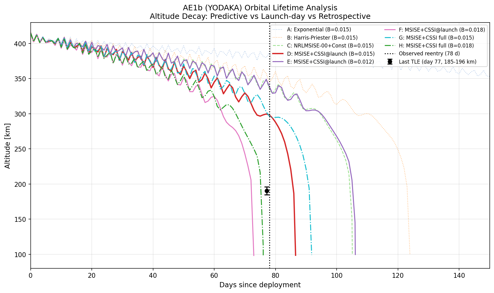

# Orbital Lifetime Analysis: AE1b (YODAKA)

ArkEdge Space の 6U CubeSat **AE1b (YODAKA, NORAD 62295)** の軌道減衰を再現し、大気モデル・太陽活動データ・弾道係数の違いが寿命予測に与える影響を比較する example。



## Target satellite

| | |
|---|---|
| Name | YODAKA (AE1b) |
| NORAD ID | 62295 |
| COSPAR | 1998-067XB |
| Bus | ArkEdge Space 6U (10 kg class) |
| Deployment | 2024-12-09 08:15 UTC (J-SSOD from ISS) |
| Decay | 2025-02-25 (CelesTrak SATCAT) |
| Observed lifetime | **78 days** |
| Initial orbit | ~415 km circular, 51.6° incl (ISS orbit) |

## Scenarios

3 グループ × 複数の大気モデル / 弾道係数で比較:

### Group 1: Predictive (打上げ前情報のみ)

| # | Atmosphere | Space Weather | B [m²/kg] |
|---|-----------|---------------|-----------|
| A | Exponential | — | 0.015 |
| B | Harris-Priester | — | 0.015 |
| C | NRLMSISE-00 | ConstantWeather(F10.7=170, Ap=15) | 0.015 |

### Group 2: Launch-day (打上げ時データでカットオフ)

CSSI 実測データを打上げ日で `truncate_after()` し、それ以降は最終日の値で外挿。

| # | Atmosphere | Space Weather | B [m²/kg] |
|---|-----------|---------------|-----------|
| D | NRLMSISE-00 | CSSI@launch | 0.015 |
| E | NRLMSISE-00 | CSSI@launch | 0.012 |
| F | NRLMSISE-00 | CSSI@launch | 0.018 |

### Group 3: Retrospective (後出し実測データ)

decay 後に取得した CSSI 実測データをフルに使用。

| # | Atmosphere | Space Weather | B [m²/kg] |
|---|-----------|---------------|-----------|
| G | NRLMSISE-00 | CSSI(full) | 0.015 |
| H | NRLMSISE-00 | CSSI(full) | 0.018 |

## Ballistic coefficient

弾道係数 $B = C_d A / (2m)$ の推定:

- **Cd = 2.2** — LEO 標準値 (Vallado, 4th ed. §8.6.2)
- **A = 0.132 m²** — bus body (0.061 m²) + deployed SAP 2 wings (0.071 m²), tumbling average
- **m = 10 kg** — ArkEdge Space "10 kg class" 6U bus

→ **B = 0.015 m²/kg** (nominal), ±20% mass uncertainty で 0.012–0.018

## Results

```
  Group | # |  Atmosphere |    Weather | B [m2/kg] | Lifetime | vs Observed
  ------+---+-------------+------------+-----------+----------+------------
   Pred | A | Exponential |          - |     0.015 |   234 days |   +156 days
   Pred | B |         H-P |          - |     0.015 |   124 days |    +46 days
   Pred | C | NRLMSISE-00 | Const(170) |     0.015 |   105 days |    +27 days
  Launch | D | NRLMSISE-00 | CSSI@launch |     0.015 |    87 days |     +9 days
  Launch | E | NRLMSISE-00 | CSSI@launch |     0.012 |   106 days |    +28 days
  Launch | F | NRLMSISE-00 | CSSI@launch |     0.018 |    73 days |     -5 days
  Retro | G | NRLMSISE-00 | CSSI(full) |     0.015 |    92 days |    +14 days
  Retro | H | NRLMSISE-00 | CSSI(full) |     0.018 |    76 days |     -2 days
  ------+---+-------------+------------+-----------+----------+------------
                 Observed                               78 days
```

Nominal B=0.015 + 打上げ時 CSSI データで **+9 days (+12%)** の精度。

## Usage

```sh
# Group 1 (predictive) only
cargo run --example orbital_lifetime -p orts

# All groups (requires network for CSSI fetch)
cargo run --example orbital_lifetime -p orts --features fetch-weather

# Generate plot
cargo run --bin orts -- convert --format csv \
    orts/examples/orbital_lifetime/orbital_lifetime.rrd \
    --output orts/examples/orbital_lifetime/orbital_lifetime.csv
uv run orts/examples/orbital_lifetime/plot_altitude.py
```

## References

- [CelesTrak SATCAT (NORAD 62295)](https://celestrak.org/satcat/records.php?CATNR=62295)
- [SatNOGS DB — YODAKA](https://db.satnogs.org/satellite/PZIL-3361-3557-2301-4863/)
- [ArkEdge Space — 6U bus](https://arkedgespace.com/en/news/multipurpose6usatellite)
- [NOAA SWPC Solar Cycle 25](https://www.swpc.noaa.gov/products/solar-cycle-progression)
- Vallado, "Fundamentals of Astrodynamics and Applications", 4th ed.
- CubeSat Design Specification Rev. 14.1, Cal Poly SLO
