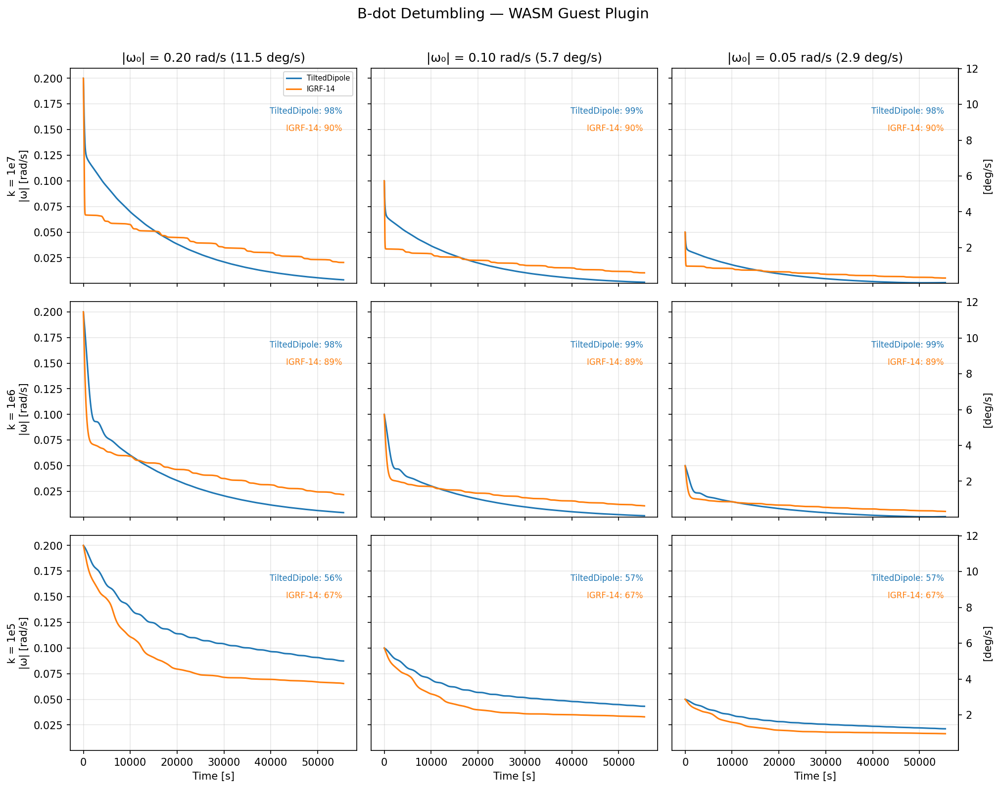

# B-dot Finite-Difference Controller — WASM Guest Plugin

B-dot detumbling controller implemented as a **WebAssembly Component** guest plugin for the orts simulator. This is the first end-to-end example of the Phase P plugin architecture: a spacecraft attitude controller written in Rust, compiled to a `.wasm` Component, loaded by the orts host via `wasmtime` + Pulley interpreter, and driven through the `PluginController` trait.

## How it works

The guest implements the `orts:plugin/controller` WIT interface:

1. **`init(config)`** — accepts a JSON config blob to set the gain, max moment, and sample period
2. **`update(observation)`** — receives the spacecraft state + epoch at each sample tick, queries the host's geomagnetic field model via the `host-env.magnetic-field-eci` import, computes the finite-difference `dB/dt` in the body frame, and returns a `Command::MagneticMoment(m)` to the host
3. The host applies the command to a `CommandedMagnetorquer` actuator and integrates the next zero-order-hold segment

The control law is the standard finite-difference B-dot:

$$
\mathbf{m} = -k \cdot \frac{\mathbf{B}_\text{body}(t) - \mathbf{B}_\text{body}(t - \Delta t)}{\Delta t}
$$

clamped per-axis to `±max_moment`. On the first sample, the command is zero (no previous measurement).

## Building

```sh
# Install cargo-component if not already:
cargo install cargo-component

# Add the WASM target (cargo-component uses wasip1 adapter internally):
rustup target add wasm32-wasip1 --toolchain 1.91.0

# Build the guest component:
cargo +1.91.0 component build --release
```

The output is `target/wasm32-wasip1/release/orts_example_plugin_bdot_finite_diff.wasm` (~70 KB).

## Running with CLI

Run the simulation using a TOML config file:

```sh
# orts-cli should be built with plugin-wasm feature
orts run --config orts.toml
```

`orts.toml` specifies spacecraft parameters, WASM plugin path, and controller gain. You can tweak control parameters by editing the config without recompiling the `.wasm`.

## Running the simulation sweep

From the **orts workspace root**:

```sh
cargo run --example wasm-bdot --features plugin-wasm --release
```

This sweeps gain × initial angular velocity × magnetic field model (3×3×2 = 18 conditions) over ~10 orbits (55,500 s) of simulated time and writes CSV files here. Both TiltedDipole and IGRF-14 magnetic field models are compared. Each CSV has columns `t, omega_x, omega_y, omega_z, omega_mag`.

## Plotting

```sh
cd plugin-sdk/examples/bdot-finite-diff
uv run plot.py
```

Produces a gain × initial-ω matrix plot:



## Oracle test

The host-side oracle test (`orts/tests/oracle_plugin_wasm_bdot.rs`) loads this guest and compares its trajectory against the native `orts::attitude::BdotFiniteDiff` controller. Both implementations compute the same finite-difference B-dot law but via independent code paths (the guest uses a hand-rolled quaternion rotation and calls `host-env.magnetic-field-eci` for the magnetic field, while the native controller uses nalgebra and calls `TiltedDipole::field_eci` directly). The oracle asserts that the final quaternion and angular velocity agree within `1e-12` tolerance.

```sh
cargo test -p orts --features plugin-wasm --test oracle_plugin_wasm_bdot
```

## Configuration

The guest accepts a JSON config blob via `init`:

```json
{
  "gain": 1e4,
  "max_moment": 10.0,
  "sample_period": 1.0
}
```

All fields are optional (defaults are shown above). The host passes this string at `WasmController::new(pre, label, config)`.
