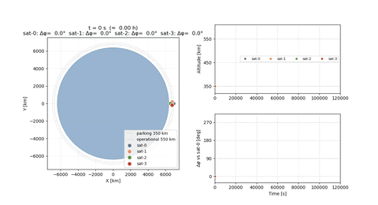
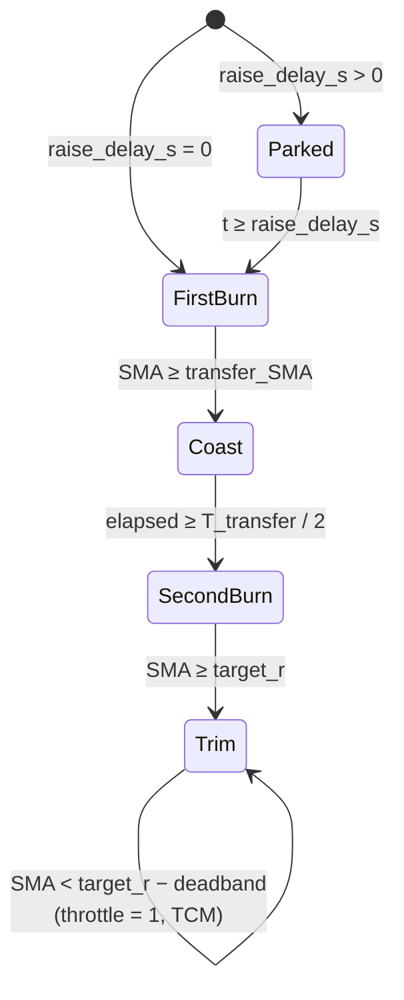
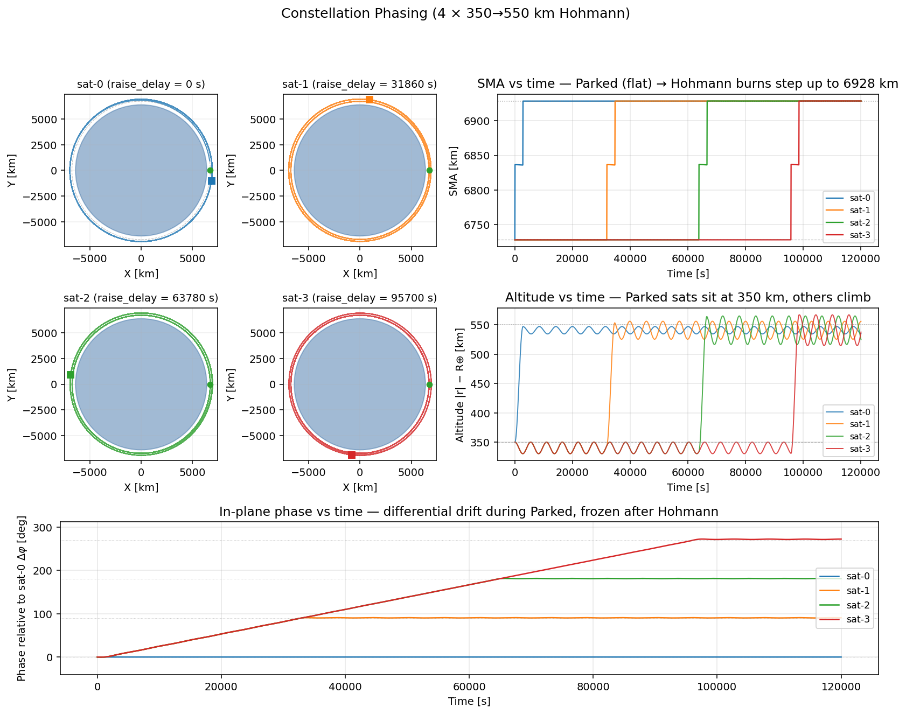
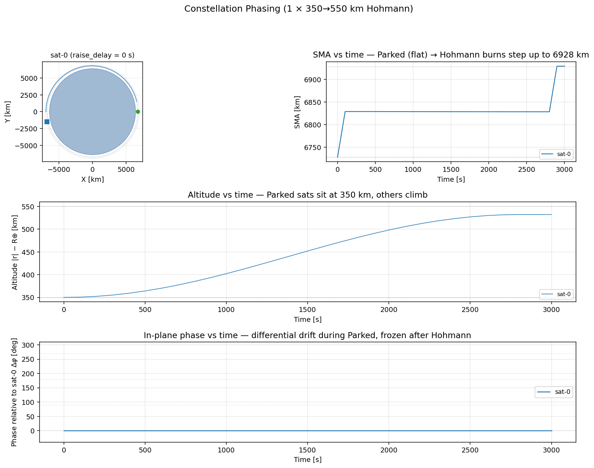
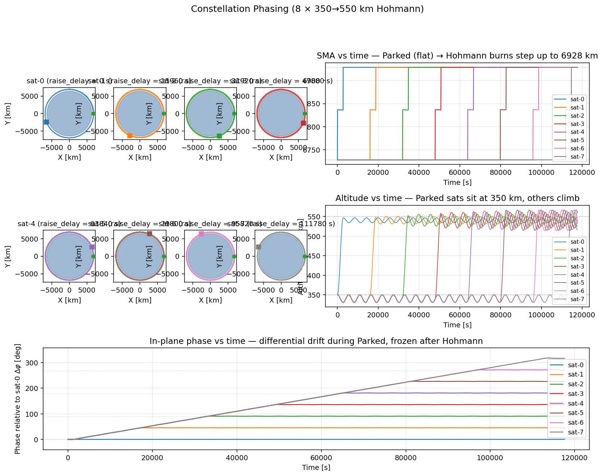
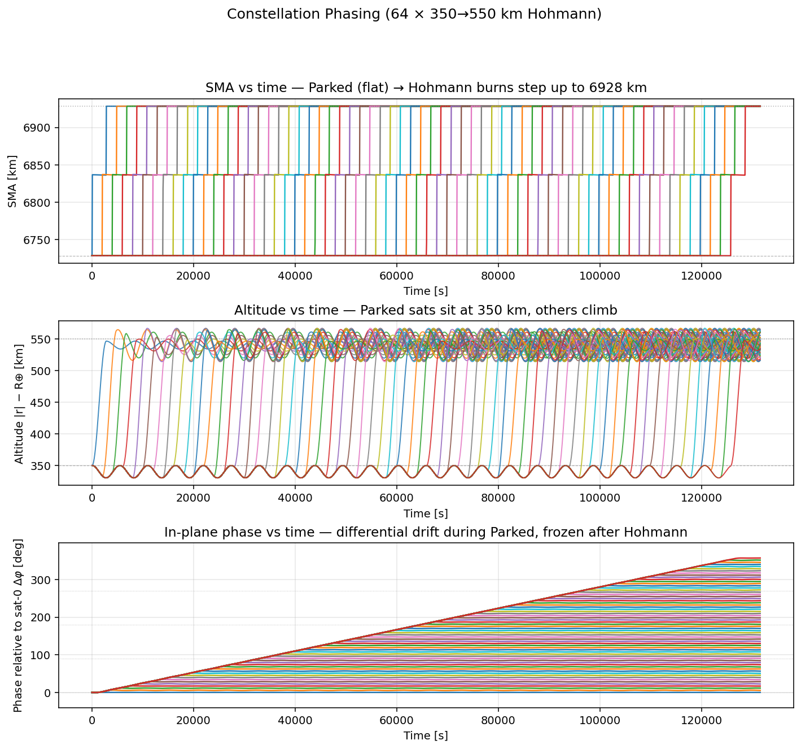
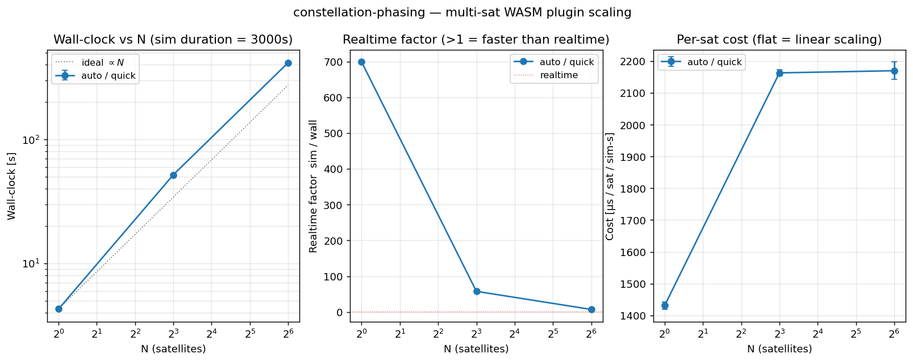

# constellation-phasing — In-Plane Phasing Demo

同じ WASM plugin を複数衛星に割り当て、**放出直後にまとまっている衛星群を軌道面内に
差動 drift で展開する**様子を示す example。



- **同一 plugin の共有**: 全衛星に同じ `.wasm` を割り当てる
- **衛星ごとに異なる config**: `raise_delay_s` を衛星ごとに変えるだけで phase 差が生じる
- **衛星ごとに独立した state**: 各衛星は独自の `Store` と worker thread/task を持ち、
  WASM 内部 state が互いに干渉しない

## Multi-sat WASM plugin の裏側

この example は orts engine 側の multi-satellite サポートに依存している。

- **Component の共有** ([orts/src/plugin/wasm/cache.rs](../../../orts/src/plugin/wasm/cache.rs)):
  `WasmPluginCache` は `.wasm` のファイルパスをキーにして Component をキャッシュする。
  複数衛星が同じパスを指定していれば、コンパイルは 1 回で済み、全衛星で同じ Component を共有する。
  キャッシュのキーは単純なパス一致なので、**symlink や相対パスの違いは別物として扱われる**
  点に注意。
- **状態の隔離** ([orts/src/plugin/wasm/sync_controller.rs](../../../orts/src/plugin/wasm/sync_controller.rs)):
  sync backend では衛星ごとに専用の OS thread と `Store` を持つ。
  async backend ([orts/src/plugin/wasm/async_controller.rs](../../../orts/src/plugin/wasm/async_controller.rs))
  では worker thread pool を共有しつつ、衛星ごとに独立した tokio task で動かす。
- **衛星ごとの `TickInput`** ([cli/src/sim/controlled.rs](../../../cli/src/sim/controlled.rs)):
  engine は衛星ごとに専用の `TickInput` を組み立てて plugin に渡す。衛星 A の controller から
  衛星 B のセンサ値は見えない。

## 仕組み: 差動 drift による in-plane phasing

prograde にしか噴射できない推進器でも、軌道面内の phase 差を作り出すことはできる。

1. 全衛星は parking 軌道（高度 350 km）の**同じ位置**から出発する
2. 衛星ごとに固有の `raise_delay_s` だけ parking 軌道に留まる
3. parking 軌道は半径が小さく周期が短いため、留まっている衛星は先に上昇した衛星より
   軌道面内で**前方に drift** していく
4. `raise_delay_s` が経過したら Hohmann 遷移で operational 軌道（高度 550 km）へ上昇する
5. `raise_delay_s` の違いが、そのまま operational 軌道上の phase offset として残る

### drift rate と delay の計算

parking / operational 軌道の平均運動は

$$
n_\text{park} = \sqrt{\frac{\mu}{r_\text{park}^3}}, \quad
n_\text{op}   = \sqrt{\frac{\mu}{r_\text{op}^3}}
$$

で、$r_\text{park} = R_\oplus + 350 = 6728\text{ km}$、$r_\text{op} = R_\oplus + 550 = 6928\text{ km}$。
その差から drift rate は

$$
\Delta n = n_\text{park} - n_\text{op}
        \approx 4.92 \times 10^{-5} \text{ rad/s}
        \approx 0.00282 \text{°/s}
$$

となる。目標 phase offset $\Delta\varphi$ に必要な delay は

$$
\text{raise\_delay\_s} \approx \frac{\Delta\varphi}{\Delta n}
$$

なので、$90° = \pi/2$ rad を稼ぐには **約 31900 s（およそ 8.9 時間）** かかる。
4 衛星を $0°/90°/180°/270°$ に配置するなら `raise_delay_s = [0, 31900, 63800, 95700]`。

duration は $\max(\text{raise\_delay\_s}) + T_\text{Hohmann}/2 + \text{buffer}$ を確保すれば足りる。
本 example では **120000 s（約 33 時間）** にしている。

## State Machine

[transfer-burn-with-tcm](../transfer-burn-with-tcm/src/lib.rs) の state machine の
先頭に `Parked` phase を追加した構成。



- **Parked**: `t < raise_delay_s` の間は throttle = 0。ただし姿勢制御（body-Y を
  prograde に向ける PD + RW）は動かしている。
- **FirstBurn / Coast / SecondBurn / Trim**: transfer-burn-with-tcm と同じ
  Hohmann のロジック。Parked → FirstBurn に遷移した時点の parking 軌道半径を使って
  transfer ellipse のパラメータを計算しなおす。

## Build

```bash
cd plugin-sdk/examples/constellation-phasing
cargo build --target wasm32-wasip2 --release
# -> ../target/wasm32-wasip2/release/orts_example_plugin_constellation_phasing.wasm
```

以下のコマンド例は `orts` CLI が PATH に入っている前提。
インストールしていなければ `cargo run --release -p orts-cli -- run ...` で代用できる。

## Run

```bash
orts run --config orts.toml --output phasing.rrd
# 4 衛星 × 120000 s で wall-clock 2〜3 分程度。dt=1.0 と粗めに積分して速度を稼いでいる。
```

結果の可視化は `rerun phasing.rrd` か [viewer/](../../../viewer/) で。

matplotlib で plot したい場合は CSV に変換してから：

```bash
orts convert --format csv phasing.rrd --output phasing.csv
uv run plot.py  # or: python3 plot.py
# -> constellation_phasing.png
```

`plot.py` は各衛星の ECI XY 軌道・SMA(t)・altitude(t) と、基準衛星（sat-0）からの
面内 phase 差 $\Delta\varphi(t)$ をまとめて 1 枚の図にする。



展開の様子をアニメーションで見たい場合は:

```bash
uv run animate.py  # or: python3 animate.py
# -> constellation_phasing.gif
```

ffmpeg があれば palette 最適化で自動的に圧縮する（無ければ素の GIF をそのまま出力）。

`plot.py` / `animate.py` は**任意の N 衛星**に対応している。CSV のパスを引数として
渡せば別のシナリオを可視化できる（衛星ごとの軌道パネルは N ≤ 8 のときのみ描画し、
それ以上では overlay の時系列グラフだけを描く）:

```bash
# 例: bench の結果 (N=8) を可視化
orts convert --format csv /tmp/orts-bench/out_N8.rrd --output /tmp/orts-bench/out_N8.csv
python3 plot.py /tmp/orts-bench/out_N8.csv
# -> /tmp/orts-bench/out_N8.png
```

### 他機数の可視化例

4 衛星 demo (`orts.toml`) と同じ **dt=1.0** で、機数だけを変えて回した結果。
衛星 $i$ が operational 軌道上の $360° \times i / N$ の位置に到達するように
（$360° / N$ 間隔の均等配置になるように）`raise_delay_s` を決めてあり、
duration は最後の衛星が Hohmann を完了するまで確保してある
（N=8 で約 118000 s、N=64 で約 132000 s）。

| N=1（短い bench 出力、参考用）| N=8（展開完了まで）|
|---|---|
|  |  |



アニメーションは同じスクリプトで生成:

| N=8 | N=64 |
|---|---|
|  |  |

上記の可視化シミュレーションを実際に回したときの wall-clock
（同ホスト、`--plugin-backend=auto` は sync を選択）:

| N  | duration [s] | wall-clock | realtime factor |
|---:|---:|---:|---:|
| 4  | 120000 | 約 2 min | 約 1000× |
| 8  | 117601 | 3:26 | 約 572× |
| 64 | 131467 | 30:35 | 約 72× |

展開完了まで回しているので、次節の 3000 s 短時間 bench よりは当然時間がかかる。
特に N=64 は 30 分程度必要なので、一度流して結果を repo に commit する運用を想定している。

## ベンチマーク（機数 vs 計算速度）

複数衛星シミュレーションのコストを計測する bench script を同梱している。

### 使い方

```bash
./bench.sh [sync|async|auto] [quick|full]
# quick: N = 1, 8, 64         / --warmup 1 --runs 3
# full : N = 1, 2, 4, 8, 16, 32, 64  / --warmup 2 --runs 7  (README 掲載値)
```

bench は demo とは別の短い duration (3000 s) で controller の scaling だけを測る。
`raise_delay_s` は `[0, 0.9 × duration]` に均等分散し、bench 中に Parked→FirstBurn
への遷移を含む全 phase が 1 度ずつ実行されるようにしてある。

### 計測結果

bench の出力は `bench_plot.py` で可視化できる:

```bash
python3 bench_plot.py  # /tmp/orts-bench/result_*.json をすべてまとめてプロット
python3 bench_plot.py /tmp/orts-bench/result_auto_quick.json  # 個別指定も可
# -> bench.png
```



環境: AMD Ryzen 7 3700X (8C / 16T), 94 GB RAM, Linux 6.19 / Arch
計測条件: duration = 3000 s, dt = 0.1, output_interval = 100 s, `--warmup 1 --runs 3` (quick mode)

#### Auto backend (`--plugin-backend=auto`)

`available_parallelism = 16` の環境では threshold が $16 \times 32 = 512$ になるので、
本 bench の N ≤ 64 では **常に sync backend** が選ばれる。

| N | wall-clock [s] | realtime factor | cost [μs / sat / sim-s] |
|---:|----------------:|----------------:|------------------------:|
| 1  | 4.29 ± 0.04 | 698.8× | 1431 |
| 8  | 51.92 ± 0.24 | 57.8× | 2163 |
| 64 | 416.66 ± 5.29 | 7.2× | 2170 |

指標の定義:

- `realtime factor = sim_duration / wall_clock` （1 より大きければリアルタイムより速い）
- `cost = wall_clock × 1e6 / (N × sim_duration)` （N に依らず一定なら linear scaling）

### 観察

- **cost は N ≥ 8 でほぼ一定** (2163 → 2170 μs/sat/sim-s, +0.3 %)。
  controller のコストは衛星数にほぼ比例して増える（linear scaling）。
- **N = 1 だけ cost が低い** (1431 μs/sat/sim-s, N = 8 の約 66 %)。
  thread 切り替えや WASM store 切り替えのオーバーヘッドは N ≥ 2 で効いてくるが、
  N = 1 では存在しないため。
- **N = 64 でも realtime の 7× 以上**で回る。bench は dt = 0.1 s で 1 sim 秒あたり
  10 回の WASM 呼び出し × 64 衛星 = 640 calls/sim-s を捌いていることになる。
  demo の orts.toml のように dt = 1.0 s に落とせばさらに約 10× 加速できる。
- auto backend の切り替え threshold は `available_parallelism × 32`
  ([cli/src/sim/params.rs](../../../cli/src/sim/params.rs))。
  16 スレッドなら 512、8 コアでも 256 なので、実用的な constellation サイズ
  （数百機程度）までは sync backend が選ばれる。
- **Full mode / async backend の計測はまだ**。`./bench.sh auto full` で
  N = 1..64 の 7 点を `--warmup 2 --runs 7` で回すと 1 時間ほどかかる。
  `./bench.sh async quick` で async backend と比較すれば、runtime overhead の有無を
  確認できる。

## 制約

- **parking より低い target は不可**: この plugin は常に body-Y を prograde に
  向けるよう姿勢制御しており、retrograde 噴射（軌道を落とす方向の制御）は実装していない。
  target altitude が parking altitude より低い設定だと軌道を下げられないので、
  FirstBurn に遷移したタイミングで Err を返して衛星を停止する。
- **初期位置**: `[satellites.orbit] type = "circular"` は true anomaly を指定する
  インターフェースを持たないため、全衛星は軌道上の同じ位置から出発する
  ([cli/src/satellite.rs](../../../cli/src/satellite.rs))。
  本 example の「放出直後まとまっている」シナリオには都合が良い。
- **大きな N での sync backend**: `--plugin-backend=sync` のまま N を数百以上に
  伸ばすと OS thread 数が実用上の限界に近づく。その領域では async backend を使う。
