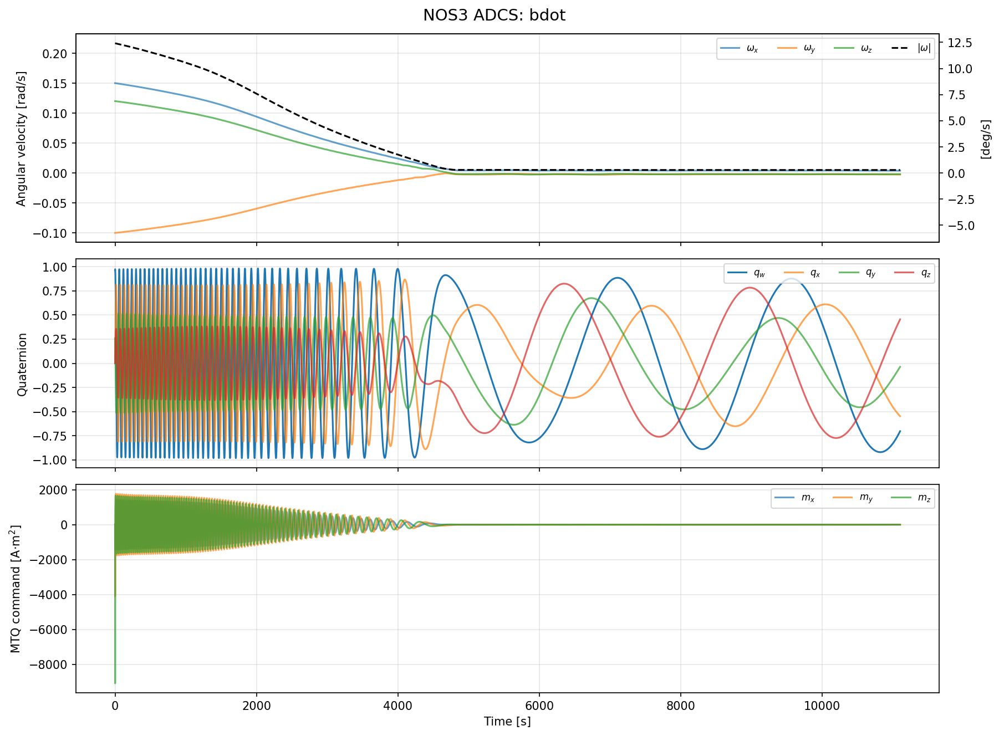
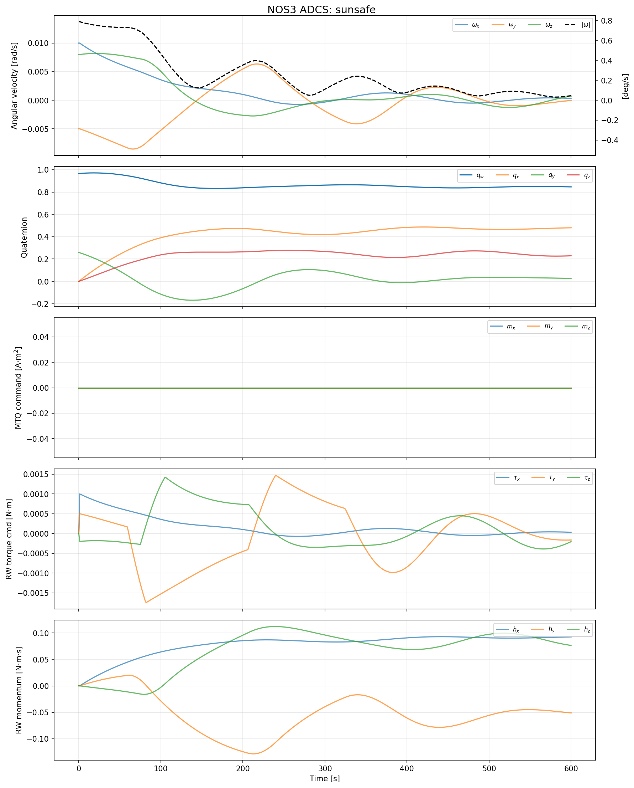
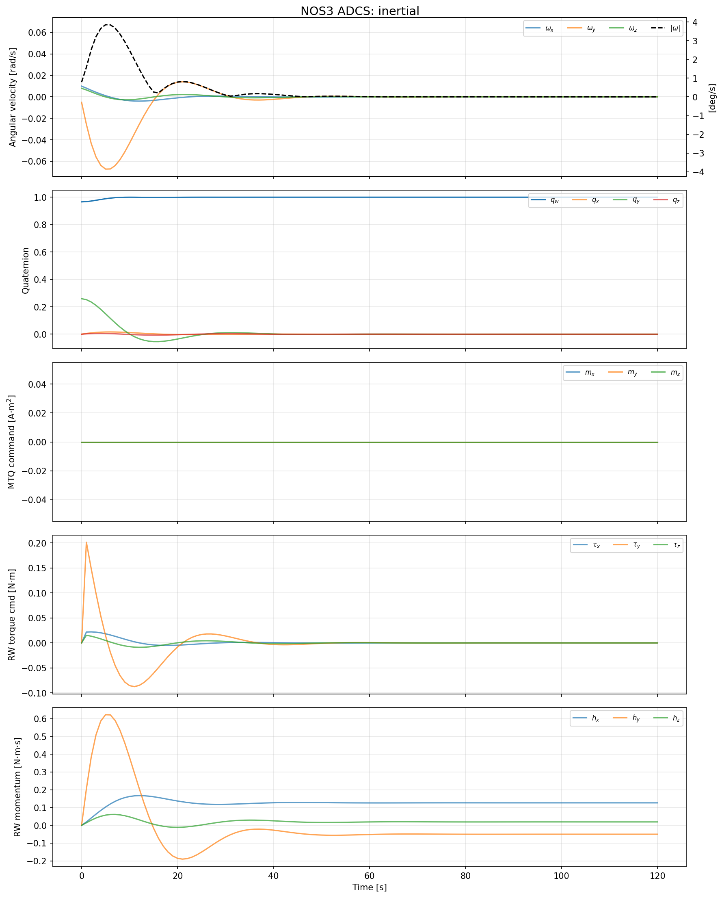
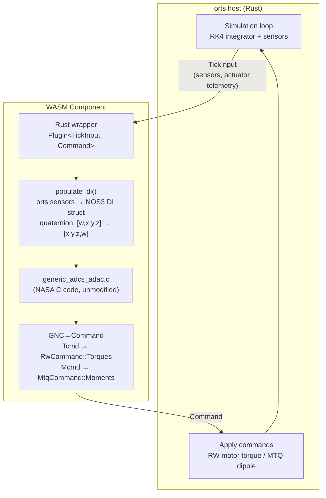

# NOS3 generic_adcs — AOCS FSW SILS Example

NASA NOS3 (Operational Simulator for Space Systems) の generic_adcs コンポーネントの
制御アルゴリズムを WASM Component としてビルドし、orts の SILS (Software-In-the-Loop
Simulation) として実行する example plugin。

既存の AOCS フライトソフトウェアの C コードを**変更なしで** WASM 化し、orts の
plugin system で動かすことで、SILS のコンセプトを実証する。

## ADCS モード

| Mode | ID | センサ | アクチュエータ | 制御則 |
|---|---|---|---|---|
| Passive | 0 | なし | なし | 制御なし |
| B-dot | 1 | 磁力計 + ジャイロ | MTQ | 磁場微分フィードバック |
| Sun-Safe | 2 | 太陽センサ + ジャイロ | RW + MTQ | PD 制御 |
| Inertial | 3 | Star Tracker + ジャイロ | RW + MTQ | クォータニオン PID |

## Prerequisites

- `cargo-component` (`cargo install cargo-component`)
- `wasi-libc` / `wasi-compiler-rt` (C → wasm32-wasip1 クロスコンパイルに必要)
  - Arch Linux: `pacman -S wasi-libc wasi-compiler-rt`
  - Ubuntu: wasi-sdk をインストール
- ネットワーク接続 (build.rs が generic_adcs リポジトリを git clone する)

## Build

```bash
cd plugin-sdk/examples/nos3-adcs
cargo component build
```

build.rs が自動で以下を行う:
1. `github.com/nasa-itc/generic_adcs` を `OUT_DIR` に git clone (commit pinned)
2. cFS 依存を除いた standalone `generic_adcs_msg.h` シムを自動生成
3. `cc` crate で C ソースを wasm32-wasip1 向けにコンパイル

## Run

```bash
orts run --config orts.toml
```

デフォルト設定は B-dot モード (mode 1) で、400km LEO での 10 分間のデタンブリングを実行する。

## Test

```bash
./test.sh              # 全モードテスト
./test.sh bdot         # B-dot のみ
./test.sh sunsafe      # Sun-Safe のみ
./test.sh inertial     # Inertial のみ
```

各モードで角速度ノルムが十分に減衰することを検証する。

## Visualization

以下のプロットは `./test.sh` の実行結果。

**共通条件:**
- 軌道: 400 km LEO 円軌道 (周期 ~5553s)
- 衛星: 慣性テンソル diag(10, 10, 10) kg·m², 質量 500 kg
- 初期姿勢: q = [0.966, 0, 0.259, 0] (15° off-nadir)
- 磁場モデル: IGRF-14 (球面調和展開 degree 13)
- RW: 3軸直交, Iw = 0.01 kg·m², max momentum = 1.0 N·m·s
- MTQ: 3軸直交, max moment = 10.0 A·m²

### B-dot Detumbling (2 orbits, ~3h)

初期角速度: ω = [0.15, -0.10, 0.12] rad/s (~12.5 deg/s, 分離直後のタンブリング状態)



### Sun-Safe Pointing (600s, post-detumble ω)

初期角速度: ω = [0.01, -0.005, 0.008] rad/s (~0.8 deg/s, B-dot デタンブリング後を想定)



### Inertial 3-axis Control (120s, post-detumble ω)

初期角速度: ω = [0.01, -0.005, 0.008] rad/s (~0.8 deg/s, B-dot デタンブリング後を想定)



### 手動でプロットを生成する場合

```bash
# CSV を生成
orts run --config orts.toml --format csv --output stdout > result.csv

# プロット (uv + matplotlib)
uv run python3 plot.py result.csv
uv run python3 plot.py result.csv --save output.png --title "B-dot Detumbling"
```

角速度・クォータニオン・MTQ コマンド・RW トルク・RW モメンタムの時系列を表示する。

## Configuration

`orts.toml` の `[satellites.controller.config]` で制御パラメータを指定する:

```toml
[satellites.controller.config]
sample_period = 1.0       # 制御サンプル周期 [s]
initial_mode = 1          # 初期モード (0=Passive, 1=B-dot, 2=Sun-Safe, 3=Inertial)
momentum_management = false

# B-dot parameters
bdot_kb = 1e4
bdot_b_range = 1e-9

# Sun-Safe parameters (PD)
sunsafe_kp = [0.01, 0.01, 0.01]
sunsafe_kr = [0.1, 0.1, 0.1]
sunsafe_sside = [1.0, 0.0, 0.0]  # 太陽指向軸 (body frame)
sunsafe_vmax = 0.01

# Inertial parameters (PID)
inertial_kp = [0.1, 0.1, 0.1]
inertial_kr = [1.0, 1.0, 1.0]
inertial_ki = [0.0, 0.0, 0.0]
inertial_phi_err_max = 1.0
inertial_qbn_cmd = [0.0, 0.0, 0.0, 1.0]  # 目標クォータニオン (scalar-last)
```

## Architecture



## Offline Build

ネットワークなしでビルドする場合は、事前に generic_adcs を clone して環境変数で指定:

```bash
git clone https://github.com/nasa-itc/generic_adcs.git /path/to/generic_adcs
GENERIC_ADCS_SRC_DIR=/path/to/generic_adcs cargo component build
```

## Known Limitations

- B-dot モードのみ E2E テスト (test.sh) あり。Sun-Safe / Inertial は手動確認済み
- CSS (Coarse Sun Sensor) のスカラー出力は方向ベクトルに変換できないため、
  FSS (Fine Sun Sensor) のみ対応
- 3-axis 直交アクチュエータ配置を前提
- ライセンス: NOS3 は NOSA 1.3 (推定)。C ソースは orts リポジトリに含まれず、
  ビルド時に git clone で取得するため再配布には該当しない

## Credits

- [NASA NOS3](https://github.com/nasa/nos3) — NASA Operational Simulator for Space Systems
- [generic_adcs](https://github.com/nasa-itc/generic_adcs) — Generic ADCS component for NOS3
