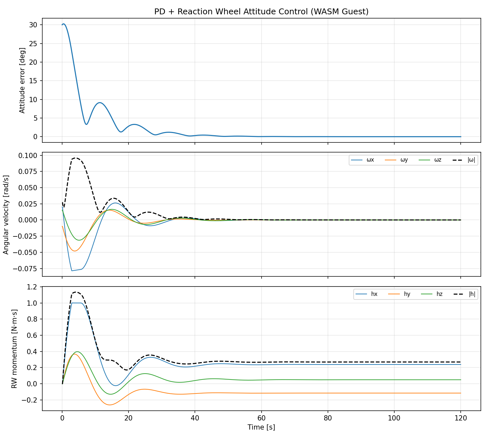

# PD + Reaction Wheel Attitude Controller — WASM Guest Plugin

PD 姿勢制御コントローラの WASM Component ゲストプラグイン。スタートラッカ (STT) とジャイロスコープのセンサ読み値から姿勢誤差を計算し、リアクションホイール (RW) にトルク指令を出す。

## 制御則

Left-invariant quaternion error による PD 制御:

```
q_err = q_target⁻¹ × q_current
θ_error ≈ 2 × q_err.vector_part  (半球選択済み)
τ = -Kp × θ_error - Kd × ω
```

ゲストは `Command::RwTorque(τ)` を返し、ホスト側の `ReactionWheelAssembly` が各ホイール軸への投影・飽和処理を行う。

## ビルド

```sh
cargo install cargo-component  # 未インストールの場合
rustup target add wasm32-wasip1 --toolchain 1.91.0

cd plugin-sdk/examples/pd-rw-control
cargo +1.91.0 component build --release
```

出力: `target/wasm32-wasip1/release/orts_example_plugin_pd_rw_control.wasm`

## シミュレーション実行

TOML config でシミュレーションを実行:

```sh
cd plugin-sdk/examples/pd-rw-control
orts run --config orts.toml --format csv
```

`orts.toml` に宇宙機パラメータ、WASM プラグインパス、センサ、RW を全て記述。Rust の再コンパイルなしに `.wasm` と config だけで制御則を差し替えられる。

初期姿勢誤差 30°（複合軸）、初期角速度あり、重力傾斜外乱込みで 120 秒のシミュレーション。

## プロット

```sh
cd plugin-sdk/examples/pd-rw-control
uv run plot.py
```

## 設定

JSON config blob で初期化:

```json
{
  "kp": 1.0,
  "kd": 2.0,
  "target_q": [1, 0, 0, 0],
  "sample_period": 0.1
}
```

- `kp`: 比例ゲイン（デフォルト 1.0）
- `kd`: 微分ゲイン（デフォルト 2.0）
- `target_q`: 目標姿勢クォータニオン `[w, x, y, z]`（デフォルト identity）
- `sample_period`: 制御サンプル周期 [s]（デフォルト 0.1）

## シミュレーション結果

初期姿勢誤差 30°（複合軸）+ 初期角速度あり、重力傾斜外乱込みで 120 秒間のシミュレーション:



- **上段**: 姿勢誤差 [deg] — 30° から急速に収束、20 秒以内に <1°
- **中段**: 角速度 [rad/s] — 振動しながら減衰、60 秒で整定
- **下段**: RW 角運動量 [N·m·s] — GG 外乱により緩やかに蓄積（unloading 未実装）

## Oracle テスト

native PD+RW 実装と WASM ゲストの比較テスト:

```sh
cargo test -p orts --features plugin-wasm --test oracle_plugin_wasm_pd_rw
```

- `wasm_pd_rw_matches_native`: native と WASM が 1e-4 以内で一致（quaternion 乗算の浮動小数点演算順の差が 60 秒で蓄積）
- `wasm_pd_rw_converges`: 初期 10° → <1° に収束、角速度 <0.01 rad/s

## センサ

ゲストは以下のセンサ読み値を使用（ホスト側 `SensorBundle` が tick ごとに評価）:

| センサ | 型 | 用途 |
|---|---|---|
| `star_tracker` | `AttitudeBodyToInertial` | 姿勢クォータニオン（誤差計算） |
| `gyroscope` | `AngularVelocityBody` | 角速度（微分項） |

センサが未設定の場合、ゲストはエラーを返す（暗黙のフォールバックなし）。

## TODO

- [ ] RW momentum unloading（磁気トルカによるデサチュレーション）
- [ ] 可視化プロット (`plot.py`)
- [ ] RRD 出力対応（現在は CSV 直接出力）
