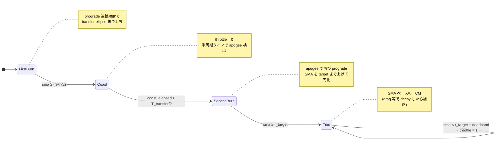
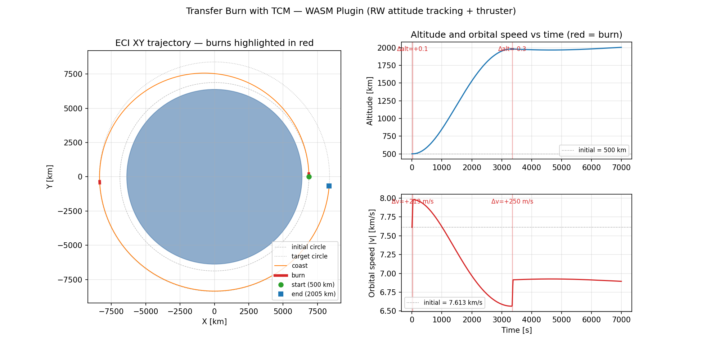

# Transfer Burn with TCM — WASM Guest Plugin

円軌道 → 円軌道の **Hohmann 遷移 + TCM (Trajectory Correction Maneuver)** を
実装した最小 plugin。**1 plugin の中で姿勢制御 (RW) と推力指令 (thruster)
を同時に司令** する composite controller の example でもある。

## 制御ループの構成

毎 tick で以下を同時に出力：

| 出力 | 内容 |
|---|---|
| `rw: RwCommand::Torques(…)` | body-Y を velocity 方向に向ける PD 姿勢制御 |
| `thruster: ThrusterCommand::Throttles(…)` | state machine で決定した throttle |

これらを `Command` の別フィールドに載せて同じ `Option<Command>` で返すだけ。
WIT v0 の `Command` record は `rw` / `mtq` / `thruster` をそれぞれ
`option` で持っているので、1 plugin でいくつでも同時司令できる。

## Thruster state machine



- **FirstBurn**: prograde 連続噴射で SMA を transfer ellipse の値
  `(r_initial + r_target)/2` まで上げる。
- **Coast**: throttle=0。transfer ellipse 上を慣性飛行。半周期タイマで
  apogee 到達を判定（finite-burn 損失で `r` がぴったり届かない場合でも
  ロバスト、実機の maneuver 計画でも一般的）。
- **SecondBurn**: target SMA まで prograde 噴射で円化。
- **Trim (TCM)**: drag や初期 burn 誤差で SMA が deadband 分下がったら
  補正 burn。instantaneous の `r` で判定すると楕円軌道 perigee で毎周期
  発火してしまうので、軌道サイズ (SMA) ベースで判定する。

## Attitude tracking (内部)

目標 body frame は LVLH の tangential-normal-radial 相当：

- `y_body_target = v̂` (prograde)
- `z_body_target = (r × v) / |r × v|` (orbit normal)
- `x_body_target = y × z` (radial-outward 近傍)

これを quaternion 化し、left-invariant error に対する PD
`τ = -Kp·θ - Kd·ω` を RW トルクとして発行。結果として body-Y の推力
ベクトルは常に prograde を向き、低推力・長時間 burn や apogee での
SecondBurn でも姿勢整合が取れる（この姿勢トラッキングがないと
半周期後の SecondBurn は retrograde になって軌道が崩壊する）。

## ビルド

```sh
cd plugin-sdk/examples
cargo build -p orts-example-plugin-transfer-burn-with-tcm --target wasm32-wasip2 --release
```

出力: `target/wasm32-wasip2/release/orts_example_plugin_transfer_burn_with_tcm.wasm`

## シミュレーション実行

付属の [`orts.toml`](orts.toml) には **500 km → 2000 km (高度 4 倍)** の
Hohmann 遷移 demo が入っている。2-body only (atmosphere=none)、sim 7000 s。

```sh
cd plugin-sdk/examples/transfer-burn-with-tcm
orts run --config orts.toml --output stdout --format csv > sim.csv
uv run plot.py   # → transfer_burn_with_tcm.png
```

## シミュレーション結果



- **左 (ECI XY trajectory)**: 地球、初期円軌道 (500 km)、目標円軌道 (2000 km)、
  実軌道 (orange) を重ね描き。FirstBurn 後の transfer ellipse が内側接線から
  目標軌道の外側接線へ伸び、SecondBurn で目標円軌道に載っている。
- **右上 (Altitude)**: 500 → 2000 km の単調上昇。FirstBurn (t ≈ 0 – 37 s) で
  一瞬ジャンプ後、Coast 中に transfer ellipse の apogee (2000 km) へ向けて
  滑らかに上昇。t ≈ 3350 s の SecondBurn で circularize。以降は deadband
  (±5 km) 内に収まっている。
- **右下 (Orbital speed)**: FirstBurn で 7.613 → 7.980 km/s に加速、Coast 中は
  vis-viva により altitude 上昇と引き換えに 7.98 → 6.55 km/s に減速、
  SecondBurn で 6.55 → 6.90 km/s に再加速して target 円軌道の speed へ。
  教科書 Hohmann の 2-impulse 特性そのもの。

## Config

Controller config は `orts.toml` の TOML として書き、host が plugin に
JSON 文字列としてシリアライズして渡す：

```toml
[satellites.controller.config]
target_altitude_km = 2000.0     # 目標円軌道高度 [km]
mu_km3_s2 = 398600.4418         # 中心天体の重力定数 [km³/s²]
deadband_km = 5.0               # TCM の dead zone 半幅 [km]
num_thrusters = 1               # [satellites.thruster.thrusters] と一致
num_rws = 3                     # [satellites.reaction_wheels] と一致
kp = 500.0                      # 姿勢 PD 比例ゲイン
kd = 150.0                      # 姿勢 PD 微分ゲイン
sample_period = 0.1             # 制御サンプル周期 [s]
```

推進器・RW の物理パラメータは host 側で定義（plugin は thrust_n / isp_s /
max_torque 等の物理量を知らなくてよい）:

```toml
[satellites.reaction_wheels]
type = "three_axis"
inertia = 0.05
max_momentum = 100.0
max_torque = 10.0

[satellites.thruster]
dry_mass = 100.0

[[satellites.thruster.thrusters]]
thrust_n = 5000.0
isp_s = 230.0
direction_body = [0.0, 1.0, 0.0]  # +Y body
```

## 制約・注意

- `num_thrusters` / `num_rws` は WIT v0 に actuator inventory API がない
  ため plugin config に書く必要がある。host の
  `[satellites.thruster.thrusters]` / `[satellites.reaction_wheels]` と
  一致させるのは開発者責任（不一致は CLI 側 length check で reject）。
- 目標高度が初期高度より低い場合、prograde のみの推進器では軌道降下
  できず plugin は FirstBurn 開始時に Err を返す。
- FirstBurn の Δv は sample_period 粒度で決まるため、精密な軌道制御には
  sample_period を小さくするか、finite-burn 計画と closed-loop 合流を
  組むとよい（今回の demo は時間ベース半周期タイマで apogee を外さない
  ロバスト設計）。

## 関連テスト

`orts run` 経由で plugin が thrust を出していることの E2E 検証：

```sh
cargo test -p orts-cli --test thruster_plugin_e2e
```
