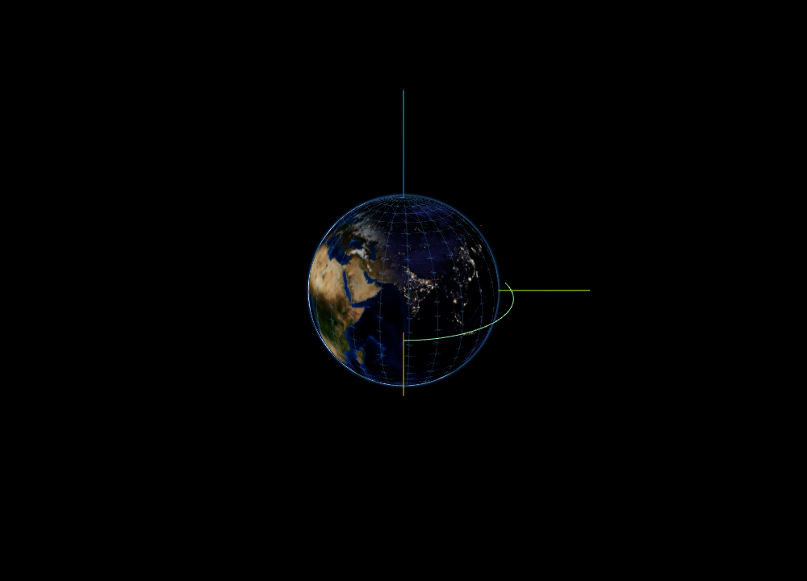
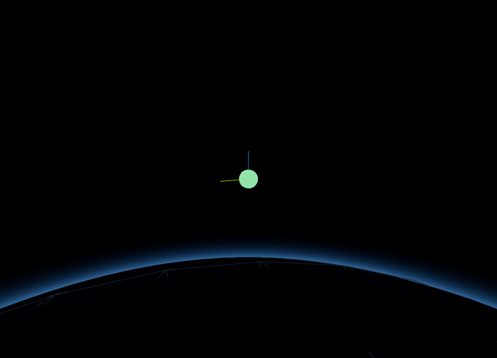

# OrbitViewer — embeddable orbit viewer

A React component that renders a central body (Earth, a planet, …) and a set of
satellites around it, with an orbit-controls camera. It's the reusable core of
the orts viewer, exposed via the package's `./lib` entry — as `OrbitViewer`
(batteries-included) or `OrbitScene` (for mounting inside your own
`@react-three/fiber` Canvas).

For one spacecraft's orientation on its own — no central body, no trails — there
is a sibling pair, `AttitudeViewer` / `AttitudeScene`. See
[Attitude view](#attitude-view).

| Central-body view (ECI) | Satellite-centred view (LVLH) |
| :---: | :---: |
|  |  |

> **Status: not yet published.** The package is still `private`. This entry is
> consumed inside the monorepo today (the app imports it from source). The build
> and packaging below are set up so it _can_ be published later without rework;
> the remaining publish steps (name, dropping `private`, `npm publish`) are
> deliberately deferred.

## Install (when published)

```sh
npm install <pkg>            # name TBD
```

`react`, `react-dom`, `three`, `@react-three/fiber`, `@react-three/drei` are
**peer dependencies** — you supply your single copy. The arika WASM engine
(Sun direction / body rotation) is also a peer dependency
([`arika-wasm`](../arika/wasm/pkg)), not bundled.

## Usage

```tsx
import { OrbitViewer } from "<pkg>/lib";

<OrbitViewer
  centralBody={{ id: "earth", radiusKm: 6378.137 }}
  satellites={[{ id: "sat-1", position: [7000, 0, 1500] }]}
/>;
```

`position` is ECI in km. Advance a `time` prop (and pass `epochJd`) for
physically-correct Sun lighting and body rotation; otherwise a fixed Sun is used
and the body is static. See [`examples/orbit-viewer`](./examples/orbit-viewer)
for an animated, backend-free example.

### Bring your own Canvas

`OrbitViewer` owns its `<Canvas>`. To compose the scene with your own lights,
meshes, post-processing or camera, mount `OrbitScene` (the same data props, minus
the wrapper/canvas) inside your Canvas — initialise the camera with `SCENE_UP`:

```tsx
import { Canvas } from "@react-three/fiber";
import { OrbitScene, SCENE_UP } from "<pkg>/lib";

<Canvas camera={{ up: SCENE_UP }}>
  <ambientLight intensity={0.3} />
  <OrbitScene
    centralBody={{ id: "earth", radiusKm: 6378.137 }}
    satellites={[{ id: "sat-1", position: [7000, 0, 1500] }]}
    controls={false}
  />
</Canvas>;
```

### Reference frames

`referenceFrame` selects what's at the origin and how the axes are aligned:

- `{ center: "centralBody", orientation: "inertial" }` — ECI-like (default)
- `{ center: "centralBody", orientation: "bodyFixed" }` — ECEF-like
- `{ center: { satelliteId }, orientation: "inertial" }` — satellite at origin,
  star-fixed axes (the body appears to move around it)
- `{ center: { satelliteId }, orientation: "localOrbital" }` — the orbit frame
  below; the body stays "below" as the satellite orbits

The orbit frame's axes are worth stating, since LVLH and RSW conventions differ
in order and sign and the attitude view draws letters on them: scene **+X** is
in-track (`crossTrack × radial`, the velocity direction for a circular orbit),
**+Y** is cross-track (`normalize(r × v)`, the orbit normal) and **+Z** is radial
*outward*, so nadir points along scene **−Z**.

### Reference-direction arrows

`directionVectors` (`{ sun, nadir }`) draws the same arrows the attitude view
draws, at the **centred satellite**:

```tsx
<OrbitViewer
  centralBody={{ id: "earth", radiusKm: 6378.137 }}
  satellites={[{ id: "sat-1", position: [7000, 0, 1500], velocity: [0, 7.5, 0] }]}
  referenceFrame={{ center: { satelliteId: "sat-1" }, orientation: "localOrbital" }}
  epochJd={2460000.5}
  directionVectors={{ sun: true, nadir: true }}
/>;
```

Omitting the prop — the default — draws none, and each field is opt-in:
`{ sun: true }` draws the Sun and not nadir. A central-body view draws none
either way: the body itself is on screen, so a nadir arrow repeats what the
picture already shows, and a pair of arrows on every satellite fills the screen.
The Sun arrow needs `epochJd`; without it the arrow is dropped rather than
pointed at a fixed direction.

### Trails

Pass `trail` (an array of points) per satellite. Trails are uploaded
incrementally: **append** to the array (new reference) to add points cheaply;
treat `satellites`/`trail` as immutable (a new reference on change — in-place
mutation isn't detected). Bump `trailVersion` to force a rebuild.

For high-rate streaming, pass a `trailBuffer` (a `TrailBuffer` you own and mutate
outside React) instead of `trail`: the scene reads it each frame, so appended
points reach the GPU without a React re-render. `trail` and `trailBuffer` are
mutually exclusive per satellite.

## Attitude view

`AttitudeViewer` shows one spacecraft's orientation and nothing else: the
spacecraft at the origin with its body axes, the reference frame's axes around
it, and the reference directions drawn as arrows.

```tsx
import { AttitudeViewer } from "<pkg>/lib";

<AttitudeViewer
  centralBody={{ id: "earth" }}
  body={{
    id: "sat-1",
    attitude: [0.707, 0, 0, 0.707],
    position: [7000, 0, 1500],
    velocity: [0, 7.5, 0],
  }}
  epochJd={2460000.5}
  orientation="localOrbital"
/>;
```

The required and optional props are the mirror of the orbit view's: `attitude` is
what this view exists to show, and `position` is read only by the things that
reference the orbit — the nadir arrow, and the `localOrbital` frame (which also
reads `velocity`). `centralBody` needs no radius: this view has no physical
length scale, and the spacecraft is normalised to one scene unit across so the
camera framing does not depend on the real size.

`orientation` picks the display frame — `"inertial"` (default), `"bodyFixed"`
(needs `epochJd`, and an Earth central body, whose rotation angle is the one the
viewer models), `"localOrbital"` (needs `position` and `velocity`, and puts the
axes where the orbit frame above does). A request whose inputs are absent falls
back to `"inertial"`.

`directionVectors` selects the arrows (`{ sun, nadir }`, both on by default). An
arrow whose input is absent is not drawn: without `epochJd` there is no Sun
direction, and a fixed arrow would read as a measurement. Arrow and body-axis
proportions are ratios of the spacecraft's apparent size, so zooming scales them
together rather than holding them constant on screen.

`AttitudeScene` is the bring-your-own-Canvas layer, as `OrbitScene` is for the
orbit view.

To compare two spacecraft, place two `AttitudeViewer`s side by side: this view
puts its spacecraft at the origin, and two cannot both be there.

## Caveats

- **Client-only.** `OrbitViewer` and `AttitudeViewer` mount a `<canvas>` and use
  `window`; they do not server-render. Under Next.js etc., import them
  client-side only (e.g. `next/dynamic` with `ssr: false`).
- **Textures.** Bodies render with a flat fallback colour unless textures are
  reachable. The built-in body texture paths are origin-relative
  (`/textures/earth_2k.jpg`, …); serve those assets, or the bodies simply fall
  back to colours. (A per-consumer base path for _built-in_ textures is a known
  gap; `textureBaseUrl` currently controls only the optional high-res upgrade
  fetched from an orts server.)
- **arika WASM.** Loaded automatically when you pass `epochJd`. To pre-load or
  point at an external `.wasm`, call `initArika({ wasmUrl })` before mounting
  (idempotent; first call wins).
- **React 19.** The peer range targets React 19 (what this is tested against).

## Public API & stability

Each view has two entry points: a batteries-included component with its own
`<div>` + `<Canvas>`, and the scene graph to mount inside your own
`@react-three/fiber` `<Canvas>`.

| View | Batteries-included | Bring your own Canvas | Data type |
| --- | --- | --- | --- |
| Orbit | `OrbitViewer` | `OrbitScene` | `SatelliteState[]` |
| Attitude | `AttitudeViewer` | `AttitudeScene` | one `AttitudeBodyState` |

Their prop types are public too (`OrbitViewerProps`, `OrbitSceneProps`,
`AttitudeViewerProps`, `AttitudeSceneProps`, `SatelliteState`,
`AttitudeBodyState`, `ViewerReferenceFrame`, `AttitudeFrame`,
`DirectionVectorOptions`, `Vec3`, …), along with the body definitions
(`DEFAULT_BODIES`, `BodyDefinition`), `MarkerShape`, `SCENE_UP`, and `initArika`.

The Three.js / react-three-fiber building blocks (`CelestialBody`, `Satellite`,
`OrbitTrail`, …) and the internal frame wiring are **not** exported — they ride
internal types and are an implementation detail. The one renderer primitive that
_is_ public is the streaming **`TrailBuffer`** (with `TrailBufferLike`, the
`OrbitPoint` it holds, and `toTrailBuffer` / `trailPointToOrbitPoint` to fill
one), so a high-rate feed can hand the scene a buffer it mutates directly. To
build a fully custom scene, drop `OrbitScene` into your own Canvas rather than
wiring primitives by hand.

## Or copy the source (shadcn registry)

Instead of depending on a published package, you can **own the source**: the
viewer is also distributed as a [shadcn](https://ui.shadcn.com/docs/registry)
registry. `shadcn add` copies the component tree into your project so you can
read and modify it freely — only the compiled `arika-wasm` engine stays a
dependency.

Build the registry, then `shadcn add` from the generated file (the manifest in
[`registry.json`](./registry.json) is generated from the library's import
closure; `registry:build` emits `public/r/*.json`):

```sh
pnpm --filter orts-viewer run registry:build       # → viewer/public/r/orbit-viewer.json
npx shadcn@4.11.0 add ./viewer/public/r/orbit-viewer.json
```

> Hosting `public/r/` at a stable URL — so `shadcn add https://…/r/orbit-viewer.json`
> works without a checkout — isn't wired up yet (the deployed site currently
> serves only the docs).

The `orbit-viewer` item installs the full import closure of both views (the
`OrbitViewer` / `OrbitScene` / `AttitudeViewer` / `AttitudeScene` components plus
the internal building blocks they use — frame/trail logic, shaders, body
definitions) under `<your components alias>/orbit-viewer/`,
preserving the internal relative imports. Copying the source gives you everything,
including the internals that `./lib` doesn't re-export. It declares `react` / `react-dom` / `three` / `@react-three/fiber` /
`@react-three/drei` as dependencies; you must **also** add `arika-wasm` yourself
(it isn't on npm yet — install it from the orts workspace until it's published).

Your `components.json` needs a `tailwind` block even if you don't use Tailwind
(the shadcn schema requires it) and `"rsc": false` (the components are
client-only — see Caveats). No Tailwind, Next.js, or CSS is otherwise required.
The copied source is bundler-neutral (it reads Vite's `import.meta.env` behind a
guarded shim), so it also compiles under non-Vite bundlers.

## Building / packaging (in-repo)

```sh
pnpm --filter orts-viewer run build:lib   # → dist-lib/ (JS + .d.ts, wasm inlined)
pnpm --filter orts-viewer exec pnpm pack   # inspect the would-be tarball
```

`build:lib` (see [vite.lib.config.ts](./vite.lib.config.ts)) externalises the
peer deps and emits to `dist-lib/`, separate from the app build (`dist/`). The
top-level `exports["./lib"]` points at source for in-repo dev; `publishConfig`
repoints it at `dist-lib` on publish.
